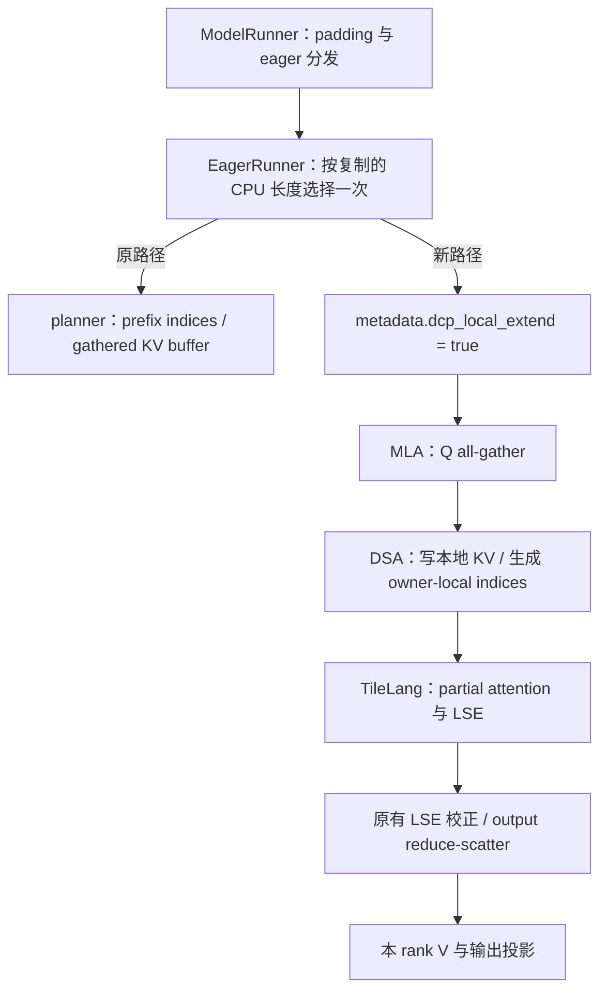

# 115：DCP eager prefill 使用本地 KV 分片

2026-09-26，Codex。候选分支 `codex/dcp-prefill-local-kv`。默认关闭；两卡开发验证，TP8 真实权重与服务成绩待验。日志归因见[本轮报告](../../notes/reports/dcp-chain-20260926.md)，独立审查后的修正与验证见[修订报告](../../notes/reports/dcp-local-extend-review-fixes-0926.md)。

## 问题与实现

现有 DCP 把每次 ordinary extend 所需的历史 KV 全量 gather，再按虚拟位置生成 gather-buffer 行号。短尾接长前缀时，为少量 Q 重搬整个 prefix；冷链分块执行时，后续块反复搬越来越长的历史。新路径 gather 同一 DCP 组的 Q，每个 rank 在本地 owner-striped KV 上算 partial attention，再用原有 LSE 加权与 reduce-scatter 恢复各自 head 的输出。token、上下文、输出预算及 MTP 验证规则不变。

调用关系由 code graph 查询和整段函数阅读确认：

选择发生在旧 planner 分配之前，所以被选择的 batch 不分配 gathered KV buffer，也不启动 prefix-index planner。此前 cold batch 已创建的持久 `loc2row` 表不会因此释放；不能把这部分也算作节省。

新 Triton kernel 把 owner 过滤、虚拟转物理、KPool 列压缩、64 列 padding 合成一次写入。KPool 展开列的 residue 与页对齐保证 `rank % gcd(W,KPool)` 的选列；保留 `-1`、尾部不足一组的合法 token，并支持非连续输入。它仅接入新 extend 路径，旧 decode/verify/draft 的选列函数保持原状。

审查后修正：ROWS/COLS/S0/S1/OUT_COLS 是运行时参数，并显式 `do_not_specialize`，避免隐式整数特化；只有有界的 owner 几何与 block size 保持静态。两张开发卡各覆盖 543 种行数/列数/步长组合，仅生成一个版本；原实现前 8 个行数生成 8 个版本。首次通用 kernel 加载/编译仍有成本，不能把预热后的计时当作首次调用延迟。

空 shard 的 partial 输出就地清理 NaN/Inf，LSE 决定其零权重。就地写入仅用于新 eager 路径独占的输出，不改图捕获中的旧路径。没有跨层缓存可变 tensor，也不引入新持久 GPU buffer。

## 开关与支持范围

- `SGLANG_AX_DCP_LOCAL_EXTEND=1`：开启短尾选择。默认 token 上限 512，prefix 至少 4096。
- `SGLANG_AX_DCP_LOCAL_EXTEND_MAX_TOKENS`：短尾上限，允许 1–1024；默认 512。用 padding 后的 token 数判定。
- `SGLANG_AX_DCP_LOCAL_EXTEND_LARGE_MAX=2048|8192`：另行开启大块实验；默认 0。选择 `2048 <= padded_Q <= LARGE_MAX`，不沿用短尾的通信量条件。只支持每 rank 8 heads、D=512、KPool=4、topk=2048。8192 以下的中间形状没有逐点性能保证。

共同范围：GLM5Next target/NextN、DCP W2、CP/DP/PP 均 1、BF16 KV、rope 维度 0、SM8x CUDA、TileLang prefill/decode、ag_rs、未开启 Q projection replication、HiSparse 或 118 Triton override。不支持的已请求组合启动时报错。prefill CUDA graph 不使用这条 eager 路径；decode/MTP 图仍走原路径。

本地索引列压缩的 KPool=4、page size 可被 4 整除条件由 `LocalExtendPolicy.from_runner` 独立检查，不依赖 `COMPACT_TOPK` 是否开启。**只开主开关，P=0 的冷首块和超过短尾上限的大块不会选中新路径。** 冷请求后续很短的尾块可能满足条件，但不覆盖开场的主要 prefill 工作；开场 chain 收益必须针对另行开启的大块路线实测。

短尾条件比较每 rank 集合通信量，P 是 prefix token 总数，T 是 padding 后的 Q 行数，H 是原本每 rank head 数，D 是 latent width，W 是 DCP 宽度：

- 原 KV gather：`P*D*2*(W-1)/W` 字节。
- Q gather + FP32 output reduce-scatter + FP32 LSE gather：`T*H*(W-1)*(6*D+4*W)` 字节。

这个条件是保守的通信量筛选，不是性能预测器。大块实测中，KPool 压缩与 head tile 利用率可能使第二条路线更快；不能仅按通信字节数否定它，也不能据此承诺 TP8 加速。

启动日志打印完整 policy；scheduler 的机制行从已经初始化的 target eager runner 读取 `dcp_local`、`dcp_local_max`、`dcp_local_large`，不回显环境变量假装生效。`G_EXPECT` 可用 `dcp_local=on dcp_local_max=512 dcp_local_large=8192`；关闭时是 `dcp_local=off dcp_local_max=0 dcp_local_large=0`。

开启主开关后，每个 rank 的 target/draft runner 各维护 `gather_kv/local_short/local_large` 的累计 batch、padded Q、prefix token 计数和最近一次 T/P。只在 ordinary eager forward 返回后计数，不包括 verify/decode 图，不声称 GPU 已同步完成。每条路线第一次执行时打印 `[ax-dcp-local]` JSON，之后最多每 30 秒一条累计快照；含 Unix 时间，CPU 常数空间，无逐形状表、GPU 同步或新 GPU buffer。按每行约 600 B 估算，TP8 target+draft 的周期日志约 1.1 MiB/小时，另加每路线首条。各 rank 是逻辑 batch 的副本，不能跨 rank 相加当请求数；prefix token 总数也不是唯一 KV token 数。窗口边界未采样的 batch 不声称已完整计入。

启动 token 证明配置生效；实际执行另用 [dcp_route_audit.py](../../scripts/analysis/dcp_route_audit.py) 检查，例如 `server.log --tp-size 8 --require local_large`。要证明测量期间触发，传原始时间戳 `--since START --until END`，只取窗口内累计快照的差；仅 warmup 触发会被拒绝。这是窗口内部已观测区间的保守计数，不冒充完整整窗账本。未传时间窗口时只证明运行中曾触发，计数包含 warmup。

关闭主开关时 policy 与计数器均为 None；旧 planner、decode predicate、gather、MTP 路径保留。

## 显存与验证边界

单 attention step 的大块路径会增加临时 Q/O 内存；完整小模型的峰值又可能由另一层决定。报告同时保留单步与整段前向测量，不能把“没有新持久 buffer”说成“没有显存代价”。TP8 接入需记录实际可用内存和 KV/KDA 池容量，并与同一引擎、开关关闭的对照比较。

数值检查包含两个 rank 的敏感 attention 输出、真实 decode graph replay、非连续高虚拟位置、KPool 尾列、全遮蔽行与空 owner shard、MTP 各阶段、真实 verifier 的接受长度 1–4、HiCache device/host restore 与真 flush。缩小 dummy 模型的最终 logits 对错误不够敏感，因此通过判断不能只看 greedy token 一致。

CPU 合同：`python3 -B -m unittest discover -s scripts/tests -p 'test_dcp_local_extend.py'`。
开发机入口：[run_dcp_devbox.sh](../../scripts/analysis/run_dcp_devbox.sh)、[dcp_check.py](../../scripts/analysis/dcp_check.py)、[整步曲线](../../scripts/analysis/dcp_local_extend_bench.py)。这些工具只在显式指定的开发机运行目录工作，不部署 Pod。
