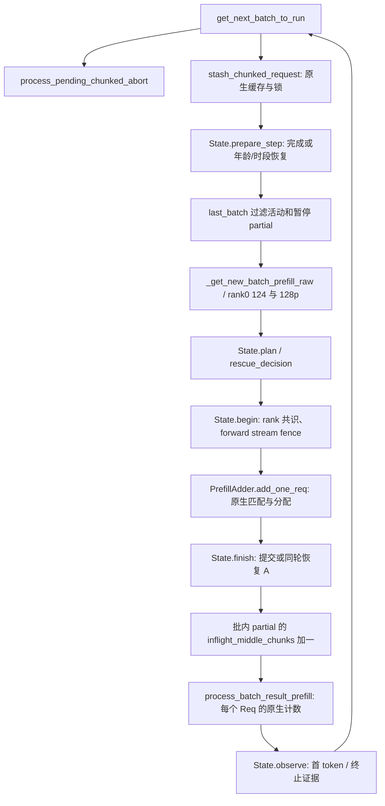

# 124：跨多轮停车与可救冷头抢占

**状态：默认关闭；c4d01e56 经 Fable 独立审查通过，TP8 短状态探针通过。N30 ON 全程零次让路，不能把 chain 14→12 归因于本机制；数值配对仍须复核。新增拒绝原因计数只做观测，待重跑。**
底为 FINAL 的 `20a58da9` 引擎（交付文档底 `6fa82ab7`）。不改 47043 的镜像、启动参数或当前队列。

开启：`SGLANG_AX_MULTI_ROUND_PARK=1`；机制收据必须含 `124m=on`，关闭为 `124m=off`。
依赖 124/120；MTP、unified memory、非生成模式拒绝启动；120 本身禁止的 PP/CP、SWA、mixed、LoRA、L3 等仍拒绝。
首版不抢占 beam/session，也不把需要 host load-back 的等待请求选作救援者。

## 问题与规则

124 原停车只容许等待请求在本轮完成。35k 实际未缓存工作放不进 16k 块，即便巨头已过期、小头仍可救，也只能等巨头连续完成。124m 保留一个额外 partial 的原生驻留状态；同一批仍只运行一个中间块。

只在以下条件同时成立时 A 让给 B：

1. A 的**实际剩余工作**超过一块；124 乐观成本也判断 A 无法按时首字。
2. B 是 124 视角的可救冷头，剩余工作超过一块，未被原生 held/128p WAIT_PREFIX 阻挡。
3. B 的成本加交接成本仍在其截止内。交接估计包括一份固定调度成本，以及 overlap 下尚未回调的 A 块的完整估计成本；这是保守模型，不是已测切换延迟。
4. 原生请求槽和 KV 预检允许；A 接收年龄 + A/B 成本 + 交接余量不触碰 A 的饥饿上限。B 最终仍须通过原生 rematch/COW/准入。

保持 124/128p 原排序，从前 64 个等待者找满足条件者；不识别请求 ID、cohort 顺序或 harness 标签。A 尚可救时不抢占；A 只剩最后一块时让其先完成。单轮短尾继续走原 124。

首版最多 **一活动、一暂停**。B 救援期间不嵌套第三个 partial，也不让 READY 预留和旧单轮停车反复切走 B 的块预算；decode cadence 保持已有 120/125/131 行为，和 133 接口独立。

B 的服务时段取 `min(1.5 × 124服务估计 + 交接估计, B剩余截止时间)`，1.5 是显式模型误差余量，尚未实测标定。B 在时段内完成就恢复 A；若时段到期或 A 接近绝对年龄上限，则 A 恢复、B 成为唯一暂停者，A 连续完成后再恢复 B。每轮只在块边界检查，因此最多会超出一个已发射块及既有 decode 间隔。

冷/暖饥饿上限沿用 124 的 600/120 s（取决于启动 env），**不修改接收时间**。还以 `min(上限,1140s)` 留出对 1200 s 无事件门的模型余量。这不是对任意 KV 阻塞或模型误差的覆盖率保证，最终覆盖率只认原 harness。

## 源码调用关系与所有权



图对应实际源码/AST 调用；本环境无可调用 codegraph 服务。未照搬专家引用的旧 `process_batch_result_prefill(chunked_req=...)` 接口：此底包已按各 Req 的 `inflight_middle_chunks` 判断中间块。

- 暂停保留原 Req、请求行、KV 锁、Mamba 当前状态及 ping-pong 跟踪槽；不释放、不复制、不退回 waiting queue。额外代价是 A 的状态驻留更久、B 同时占用自己的原生池资源，不是“只多一个 KDA 槽”。
- `len(prefix_indices)` 是已提交给原请求续算的位置；`cache_protected_len` 可能落后。恢复用无 cache 参数的 `init_next_round_input()`，不会把可复用检查点当成活状态位置，更不会减一 token。
- 仅在实际切换/释放时 fence forward stream；普通块没有新增 GPU 全局同步。旧 CPU 回调继续消耗它所属 Req 的中间块计数。
- B 最后一块已安排但尚未回调时，不恢复 A、不准入第三个 partial。首 token 回调到达后再恢复。
- rank0 广播决策、序号、A/B 已算位置和 A 在飞计数。分配前共识不成立，整组取消切换；原生准入后范围/中间块归属若分歧，明确报错停止，不能继续发射不同形状。
- 原生准入失败且未消耗预算时，同一次调度恢复 A。暂停者计入请求槽逻辑上限、pending tokens、125 积压、128p live 集、内存检查、abort、retract、idle/flush。
- abort 等 GPU 写入完成后，按原生清理恰好释放一次。全体排空前 flush 返回失败；排空后真正清池及机制状态。

## 观测与验证

`[ax-124m]` 仅记录状态变化（yield/resume/rollback/decline/first_token/terminal），不输出正文或逐 token 轨迹。每次成功救援通常 4 行，另有失败准入/异常清理行；按实际事件数线性增长，不截断证据。记录完整 RID、序号、rank0 时间、A/B 剩余量和 slack、交接/服务时段估计、computed/checkpoint/allocated、首 token 时间及服务端 TTFT/1200 s 风险代理。

CPU：

```bash
PYTHONPATH=tests python3 -B -m unittest test_multiround_park test_chain_risk_scheduler test_ax_deadline test_prefix_producer test_ax_admission_scheduler -q
python3 -B scripts/analysis/verify_multiround_park_gloo.py --source engine/sglang/srt/managers --output /tmp/124m-gloo.json
```

本轮合计 134 项（15 项 124m 用例 + 119 项既有相关用例）；8 进程 Gloo 的 4 场景全部 PASS，收据在 Pod `/tmp/ax/codex/multiround-0928/gloo.json`。

前者调用真实 scheduler、PrefillAdder、结果回调和生命周期方法的 AST，只有池/请求/GPU 是假件。后者用 8 个真实 Gloo 进程测 root/follower 年龄反向、恢复、单 rank 前置条件失败、分配范围分歧；**均不等于 TP8 数值证明**。

TP8 验证边界：

1. 已做同引擎 ON 与 OFF 两次重复的短状态探针；实际 yield/resume、页/256 长度边界、部分命中/分叉、暂停 A/B abort、暂停中 flush 拒绝及排空后清池通过。测试专用 124 冷截止 8 s，两臂相同，不把此臂当 SLO。全局 abort_all、强制 lease 到期及完整张量一致性尚未覆盖。
2. 检查 KV 页不重用、KDA 句柄和状态位置不变、无多余首 token 或重复释放；固定输入的数值与 OFF/OFF 噪声对照。CPU 的 255/256/257 测的是簿记，不能替代真实 kernel 边界。
3. FINAL 配置仅加 `SGLANG_AX_MULTI_ROUND_PARK=1`、`G_EXPECT+=124m=on`，rot150/N30 相同派发窗口并排空，对 eznb。优先同提交 OFF 孪生；对 eznb 是跨提交默认关闭代码对照，须明确标记。

第一行报告 chain **救回/新增/净减少**，再分开场/稳态与原始头类型；同时报告派发 ID 集合差异、暂停次数/时长、A 最终覆盖率、TPOT p95、fast 代价。闭环中的同 ID 配对仅用于归因，不能替代完整派发与排空。尚无 chain 收益结论，不并入上传候选。

### 固定输入短状态探针（ezndz/eznfz 已闭合）

任务入口：[`tp8_124m_state_on.sh`](../../scripts/pod/jobs/tp8_124m_state_on.sh) 与
[`tp8_124m_state_off.sh`](../../scripts/pod/jobs/tp8_124m_state_off.sh)，客户端
[`multiround_park_probe.py`](../../scripts/pod/verify/multiround_park_probe.py)。
两臂引擎都固定 c4d01e56，均在 FINAL 参数上把 **测试用冷预算设为 8 s**，只有 124m 开关不同。
该预算让无其他负载的 196k A 也被判不可救，从而确定地尝试救援 33.5k B；是否真的让路仍须看日志。
合成 token IDs 只用来测驻留状态，不替换比赛数据，不用于能力门或 SLO。

每臂请求阶段上限 240 s，异常清理只取消自己的 RID 前缀；启动另计。按近期约 170 s 启动，一臂预计在 10 分钟内，冷 JIT 或加载变慢时不能保证总墙钟。无需重建镜像；make_kit 已加入客户端。由队列负责人排队，审阅工具不发送 GPU 请求。

- ON：A 长度 196608−1、196608、196608+1；另先算 4097-token 前缀再分叉，要求 A 实际有部分命中。A 首次入批后 1.2 s 发 B，必须看到 `yield`、恢复和每个完整请求唯一的首 token 记录。
- 暂停 A 与活动 B 分别 abort，检查真实 terminal 记录及另一个请求完成；暂停中 flush 必须拒绝，完全排空后必须成功；abort 后重放长请求。首版不发全局 abort_all。
- OFF：同输入、同到达触发重复两次。收集输出 IDs、有限 logprobs/top-8 与时间，不采集巨量 input logprobs。ON/OFF 的数值判断独立于状态结果；token 分歧之后不再比较不同条件下的 logprob。
- 无实际 yield、没命中种子前缀、缺恢复/首 token、错误或请求阶段超时均记 INVALID/NOT_COVERED。STATE_PASS 仅表示以上覆盖通过，**不等于数值通过、完整 KV/KDA 张量相等或 N30 通过**。日志原文和响应留在本次 run，不覆盖旧目录。

两臂闭合后：

```bash
python3 -B scripts/pod/verify/multiround_park_probe.py compare \
  --off /path/to/off/probe/receipt.json --on /path/to/on/probe/receipt.json \
  --out /path/to/numeric-comparison.json
```

只有 ON 的逐 token logprob 都落在两次 OFF 的观测范围内，才记 WITHIN_OBSERVED_OFF_NOISE；否则保留原值给独立复核，不设凭空容差、不自动宣称错误。此短测不覆盖高 KV 压力回滚、强制 lease 到期及全局 abort_all；前者还须在 N30 配对中按 rollback/decline、驻留占用与失败请求一起解释。

实测 ON 107.2 s、OFF 150.3 s（不含启动）；ON 共 7 次 yield、6 次 resume、12 个首 token、2 次预期 abort。部分命中实测 4096 token。数值比较为 NUMERICAL_REVIEW_REQUIRED：OFF/OFF 本身也有输出 token 分歧，ON/OFF 不能据此判等。原始收据在 `evidence/T124m-tp8-0928/`。

### 零触发观测：只统计，不调整门槛

`State.plan()` 仍在既有 rank0 决策广播内执行。新增 `[ax-124m-plan]`，每 30 s 有计划活动时一行；真正 flush 额外结清未满 30 s 的窗口并递增 epoch。没有新增 collective、GPU 同步、缓存匹配或策略调用，默认关闭仍不创建 State。日志的计划次数不是 scheduler 总轮数：早于 plan 的 batch/空队列等返回不计入；服务停止前不足 30 s 且未 flush 的尾段可能没有摘要。

- `outcomes` 按计划计数：no_owner、already_parked、owner_finished、owner_unsupported、batch_full、slot_room、running_limit、selected、none。
- `candidates_scanned` 与 `rejections` 按候选检查次数计数，同一 B 等待多轮会重复计数。首个实际拒绝分支为 b_held、b_hostload、b_unsupported、kv_room、missing_receive_time、b_too_small、owner_tail、b_warm、owner_rescuable、b_late、age_limit。none 表示该计划未找到候选，不与候选拒绝数相加。
- 每个原因每窗口至多保留一个完整 RID 样本；能实际走到成本判断才记录 slack/age/remaining/handoff。特别不为 held/hostload/KV 拒绝者额外调用 deadline_cold，以免提前冻结类别、把“加日志”变成策略变化。按本数据 RID 长度通常每行数 KiB，不记录正文或逐 token 内容。
- begin/finish 原有 decline/rollback 是后续事务失败；与 plan 预检拒绝分开。没有 rollback 不能推出 KV 没挡住机会，需看 kv_room/batch_full 等上游计数。

历史 35k 反事实来自 ezn9/S1，而非 eznb/FINAL：同 ID 在 S1 TTFT 36.0 s，在 FINAL 2.49 s、ezne 6.01 s、eznf 2.70 s。其占道者 150249 token、命中14848、TTFT20.30 s，按冷代理使用30 s预算，并非仅因超过 turn 的15 s门就会被124判死。CPU保守重建在 B 到达时给 A 全部150249 token尚未算，余量仍大于9 s，因此成本门返回 owner_rescuable；历史真实 held/KV/首见类别快照未保存，不能补称逐块实测。新计数用于区分实际负载的各类拒绝，不针对该 ID 调门槛。
