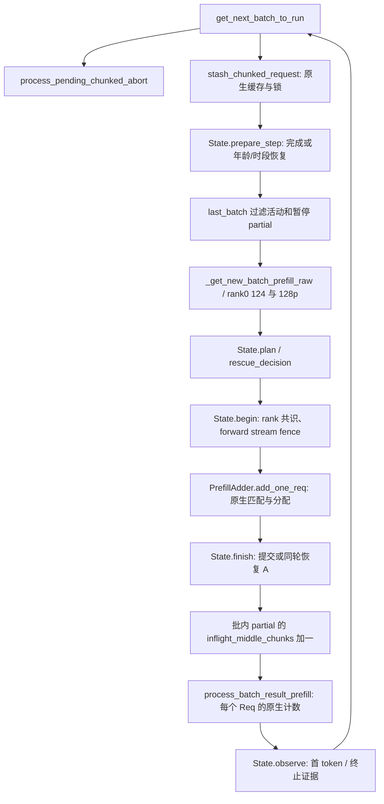

# 124：跨多轮停车与可救冷头抢占

**状态：默认关闭；CPU 调度/生命周期测试与 8 进程 Gloo 通过，TP8 状态与 chain 净收益待测。**
底为 FINAL 的 `20a58da9` 引擎（交付文档底 `6fa82ab7`）。不改 47043 的镜像、启动参数或当前队列。

开启：`SGLANG_AX_MULTI_ROUND_PARK=1`；机制收据必须含 `124m=on`，关闭为 `124m=off`。
依赖 124/120；MTP、unified memory、非生成模式拒绝启动；120 本身禁止的 PP/CP、SWA、mixed、LoRA、L3 等仍拒绝。
首版不抢占 beam/session，也不把需要 host load-back 的等待请求选作救援者。

## 问题与规则

124 原停车只容许等待请求在本轮完成。35k 实际未缓存工作放不进 16k 块，即便巨头已过期、小头仍可救，也只能等巨头连续完成。124m 保留一个额外 partial 的原生驻留状态；同一批仍只运行一个中间块。

只在以下条件同时成立时 A 让给 B：

1. A 的**实际剩余工作**超过一块；124 乐观成本也判断 A 无法按时首字。
2. B 是 124 视角的可救冷头，剩余工作超过一块，未被原生 held/128p WAIT_PREFIX 阻挡。
3. B 的成本加交接成本仍在其截止内。交接估计包括一份固定调度成本，以及 overlap 下尚未回调的 A 块的完整估计成本；这是保守模型，不是已测切换延迟。
4. 原生请求槽和 KV 预检允许；A 接收年龄 + A/B 成本 + 交接余量不触碰 A 的饥饿上限。B 最终仍须通过原生 rematch/COW/准入。

保持 124/128p 原排序，从前 64 个等待者找满足条件者；不识别请求 ID、cohort 顺序或 harness 标签。A 尚可救时不抢占；A 只剩最后一块时让其先完成。单轮短尾继续走原 124。

首版最多 **一活动、一暂停**。B 救援期间不嵌套第三个 partial，也不让 READY 预留和旧单轮停车反复切走 B 的块预算；decode cadence 保持已有 120/125/131 行为，和 133 接口独立。

B 的服务时段取 `min(1.5 × 124服务估计 + 交接估计, B剩余截止时间)`，1.5 是显式模型误差余量，尚未实测标定。B 在时段内完成就恢复 A；若时段到期或 A 接近绝对年龄上限，则 A 恢复、B 成为唯一暂停者，A 连续完成后再恢复 B。每轮只在块边界检查，因此最多会超出一个已发射块及既有 decode 间隔。

冷/暖饥饿上限沿用 124 的 600/120 s（取决于启动 env），**不修改接收时间**。还以 `min(上限,1140s)` 留出对 1200 s 无事件门的模型余量。这不是对任意 KV 阻塞或模型误差的覆盖率保证，最终覆盖率只认原 harness。

## 源码调用关系与所有权



图对应实际源码/AST 调用；本环境无可调用 codegraph 服务。未照搬专家引用的旧 `process_batch_result_prefill(chunked_req=...)` 接口：此底包已按各 Req 的 `inflight_middle_chunks` 判断中间块。

- 暂停保留原 Req、请求行、KV 锁、Mamba 当前状态及 ping-pong 跟踪槽；不释放、不复制、不退回 waiting queue。额外代价是 A 的状态驻留更久、B 同时占用自己的原生池资源，不是“只多一个 KDA 槽”。
- `len(prefix_indices)` 是已提交给原请求续算的位置；`cache_protected_len` 可能落后。恢复用无 cache 参数的 `init_next_round_input()`，不会把可复用检查点当成活状态位置，更不会减一 token。
- 仅在实际切换/释放时 fence forward stream；普通块没有新增 GPU 全局同步。旧 CPU 回调继续消耗它所属 Req 的中间块计数。
- B 最后一块已安排但尚未回调时，不恢复 A、不准入第三个 partial。首 token 回调到达后再恢复。
- rank0 广播决策、序号、A/B 已算位置和 A 在飞计数。分配前共识不成立，整组取消切换；原生准入后范围/中间块归属若分歧，明确报错停止，不能继续发射不同形状。
- 原生准入失败且未消耗预算时，同一次调度恢复 A。暂停者计入请求槽逻辑上限、pending tokens、125 积压、128p live 集、内存检查、abort、retract、idle/flush。
- abort 等 GPU 写入完成后，按原生清理恰好释放一次。全体排空前 flush 返回失败；排空后真正清池及机制状态。

## 观测与验证

`[ax-124m]` 仅记录状态变化（yield/resume/rollback/decline/first_token/terminal），不输出正文或逐 token 轨迹。每次成功救援通常 4 行，另有失败准入/异常清理行；按实际事件数线性增长，不截断证据。记录完整 RID、序号、rank0 时间、A/B 剩余量和 slack、交接/服务时段估计、computed/checkpoint/allocated、首 token 时间及服务端 TTFT/1200 s 风险代理。

CPU：

```bash
PYTHONPATH=tests python3 -B -m unittest test_multiround_park test_chain_risk_scheduler test_ax_deadline test_prefix_producer test_ax_admission_scheduler -q
python3 -B scripts/analysis/verify_multiround_park_gloo.py --source engine/sglang/srt/managers --output /tmp/124m-gloo.json
```

本轮合计 134 项（15 项 124m 用例 + 119 项既有相关用例）；8 进程 Gloo 的 4 场景全部 PASS，收据在 Pod `/tmp/ax/codex/multiround-0928/gloo.json`。

前者调用真实 scheduler、PrefillAdder、结果回调和生命周期方法的 AST，只有池/请求/GPU 是假件。后者用 8 个真实 Gloo 进程测 root/follower 年龄反向、恢复、单 rank 前置条件失败、分配范围分歧；**均不等于 TP8 数值证明**。

TP8 尚需：

1. 同引擎 OFF/ON/OFF 短状态探针；长 A 发射几块后到达 B，必须从日志证实实际 yield 和 resume。覆盖页/256 检查点前后、部分命中/分叉、decoder 并存、暂停 A/B/abort_all、暂停中 flush 拒绝及排空后清池。可用更短的测试专用 124 截止触发机制，两臂完全相同，不把此臂当 SLO。
2. 检查 KV 页不重用、KDA 句柄和状态位置不变、无多余首 token 或重复释放；固定输入的数值与 OFF/OFF 噪声对照。CPU 的 255/256/257 测的是簿记，不能替代真实 kernel 边界。
3. FINAL 配置仅加 `SGLANG_AX_MULTI_ROUND_PARK=1`、`G_EXPECT+=124m=on`，rot150/N30 相同派发窗口并排空，对 eznb。优先同提交 OFF 孪生；对 eznb 是跨提交默认关闭代码对照，须明确标记。

第一行报告 chain **救回/新增/净减少**，再分开场/稳态与原始头类型；同时报告派发 ID 集合差异、暂停次数/时长、A 最终覆盖率、TPOT p95、fast 代价。闭环中的同 ID 配对仅用于归因，不能替代完整派发与排空。尚无 chain 收益结论，不并入上传候选。
