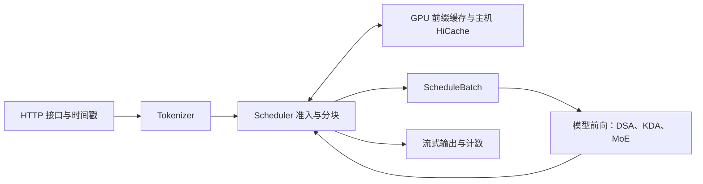

# 最新 N42 提交的源码地图

2026-10-03，Codex 整理。适用对象是 [CAP / 47798 的冻结配置](../submission/official-0930-CAP.json) 与引擎 `ca5d646c`；机制解释沿用原始提交，运行与成绩依据见 [提交记录](submissions.md)。

## 先理解一条请求

冷链首通常要算很长的 prompt。调度决定它什么时候进入、每次算多少、何时穿插 decode；缓存决定多少历史能复用；模型和算子决定同样的工作要花多少时间。三者共同影响最终表现，不能把单算子加速直接当作正式并发收益。

| 环节 | 从哪个文件读 | 先问什么 |
| --- | --- | --- |
| HTTP 与服务端计时 | [http_server.py](../engine/sglang/srt/entrypoints/http_server.py)、[request_headers.py](../engine/sglang/srt/entrypoints/request_headers.py) | 收到请求、完成 prefill、开始输出怎样计时？ |
| 原生调度入口 | [scheduler.py](../engine/sglang/srt/managers/scheduler.py)、[schedule_policy.py](../engine/sglang/srt/managers/schedule_policy.py) | 请求怎样排序、组成 batch、在 prefill 和 decode 之间切换？ |
| 截止时间与 chain 保护 | [ax_deadline.py](../engine/sglang/srt/managers/ax_deadline.py)、[ax_rank0_decision.py](../engine/sglang/srt/managers/ax_rank0_decision.py) | 冷/热请求预算、饥饿边界和 TP rank 一致性怎样保证？ |
| 共享前缀 | [ax_prefix_producer.py](../engine/sglang/srt/managers/ax_prefix_producer.py)、[ax_prefix_readiness.py](../engine/sglang/srt/mem_cache/ax_prefix_readiness.py) | 哪个请求先产出可复用前缀，等待者何时能跟上？ |
| GPU / host 缓存 | [unified_radix_cache.py](../engine/sglang/srt/mem_cache/unified_radix_cache.py)、[hybrid_pool_assembler.py](../engine/sglang/srt/mem_cache/hybrid_cache/hybrid_pool_assembler.py) | KV、DSA 索引和 KDA 状态是否一起保持所有权与可用性？ |
| 模型执行 | [glm5_next.py](../engine/sglang/srt/models/glm5_next.py)、[eager_runner.py](../engine/sglang/srt/model_executor/runner/eager_runner.py) | 模型怎样调用下面三类计算？ |
| DSA | [dsa_backend.py](../engine/sglang/srt/layers/attention/dsa_backend.py)、[sm80_indexer_kernels.py](../engine/sglang/srt/layers/attention/dsa/sm80_indexer_kernels.py) | 索引打分、top-k 和稀疏注意力各自算什么？ |
| KDA | [kda_backend.py](../engine/sglang/srt/layers/attention/linear/kda_backend.py)、[kda_prepare_sm80.py](../engine/sglang/kernels/ops/attention/fla/kda_prepare_sm80.py) | 状态和快照怎样复用，prefill 为什么能减少重复准备？ |
| MoE | [fp8_humming_moe.py](../engine/sglang/srt/layers/quantization/fp8_humming_moe.py)、[fp8_humming_tuning.py](../engine/sglang/srt/layers/quantization/fp8_humming_tuning.py) | A100 怎样执行 FP8 权重专家，哪些形状选不同配置？ |

## 47798 实际使用的路径

完整启动命令和 58 项环境变量以冻结 JSON 为准。此表解释它们的职责，不能替代配置。

| 组 | 已启用的机制 | 看哪些说明 |
| --- | --- | --- |
| 接口与 A100 基础执行 | 000、101、106、110、111 的兼容/回退路径、114 | [引擎说明](../engine/README.md) |
| 缓存与调度 | 120/121、124、125、128 prefix producer、131、132、180；Mamba 池 400，host64，短请求阈值 2048 | [124](../engine/docs/124-deadline-admission.md)、[128](../engine/docs/128-prefix-producer.md)、[131](../engine/docs/131-chain-risk-interval.md)、[132](../engine/docs/132-chain-first.md)、[180](../engine/docs/180-hicache-glm-dsa.md) |
| prefill 执行 | Humming 117 及大块投影调参、118 prefill-only、attention-TP 输入分片、170 的三个 KDA prefill 开关 | [117](../engine/docs/117-sm80-fp8-moe-humming.md)、[118](../engine/docs/118-dsa-sparse-triton.md)、[KDA prefill](../engine/docs/170-kda-sm80-prefill.md) |
| 09-30 执行改动 | 175、176、178、179、181、182、184 | [逐提交说明](read-history.md#09-30-执行改动) |
| CAP 配置 | 普通冷块 12288，积压冷块 16384；积压 interval0，常态 PDI2，chain-risk1 | [冻结配置](../submission/official-0930-CAP.json) |

MTP、DCP、本地 DCP extend、122 pace、126 demand cap、旧 128 family ranking、130 async tokenize、140 dual snapshot、171/172 fusion、174 packed decode、177 metadata graph 与实验 metadata fusion 在这份配置里关闭或未请求。源码仍保留，方便追溯探索和比较；默认关闭和已经进入源码不能证明运行时使用了某条路径。

机制 170 同时承载早期 breakable prefill graph 与后来 KDA prefill 执行优化。最新提交没有启用 breakable prefill graph，但启用了三个 KDA prefill 开关，两者应分别理解。机制文档中的“候选 / 待 TP8”描述是该补丁写入时的验证范围；后续组合服务与正式评测另看实验和提交记录，不能把组合成绩分摊给每个补丁。

## 再回到提交

阅读 [read-history.md](read-history.md) 中的具体 commit，先看新增的条件、回退、状态或资源所有权，再看对应测试和运行证据。底包源码阅读地图在 [research/](../research/README.md)，它解释原始实现；本页用于把那张地图接到最新源码。
