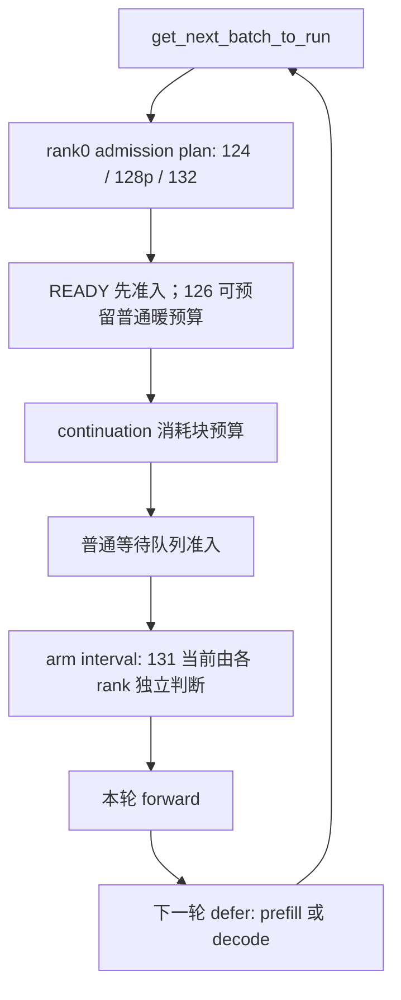

# Chain-max 审查：TP 一致性、暖请求预算与长链救援边界

2026-09-27，Codex。审查对象：`c1fa4877` 的 132 补丁，以及 `tail_n26_chainmax16k_40m.sh` 实际启用的 120/124/125/128p/131/132 组合。独立分支 `codex/review-chainmax-0927`。本次只提交报告、分析脚本和派生证据，没有修改引擎、运行任务或正式提交。

结论：**支持继续验证 16k 组合；不建议原样发布。先修 131 的跨 rank 决策一致性，再解决普通短暖请求没有真实预算的问题。** 132 新增的排序键没有发现越界、破坏稳定排序或默认关闭行为的缺陷；严重问题来自组合继承的 131 和配置之间的相互作用。以下分别标注代码事实、CPU 复现、TP8 历史观测和推断。

## 1. P1：131 的时间和冷暖状态没有同步，TP ranks 能安排不同的下一轮

位置：[scheduler.py](../../engine/sglang/srt/managers/scheduler.py) 的 `_arm_prefill_decode_interval`（1963）、`_ax_chain_risk_interval`（1998）、`_should_defer_prefill`（1956）；[ax_deadline.py](../../engine/sglang/srt/managers/ax_deadline.py) 的 `deadline_cold`（117）。

**代码事实：** 每个 rank 在 `_arm_prefill_decode_interval` 中独立调用 131。131 使用本地 `time.perf_counter()`、本地 `scheduler_recv_time` 和请求的 `_ax_deadline_cold`，直接写 `_prefill_decode_interval_remaining`。这条路径没有 `_ax_rank0_decide`。下次调度中，计数器控制是否进入含 rank0 broadcast 的 prefill 准入路径，或者直接 decode。

另外，124/128p 的排序在 rank0 执行，因此第一次观察请求时冻结的 `_ax_deadline_cold` 不会随排序计划广播。其他 rank 直到 131 才可能首次冻结分类；等待期间若已获得家族缓存，两个 rank 即使时钟相同，分类也可能不同。

**CPU 复现（真实 arming/defer 方法，GPU/缓存为测试替身）：**

| 条件 | rank0 | rank1 |
|---|---|---|
| 同一请求剩余 200,000 token，等待时间 3.90 / 3.92 s | interval=2 | interval=1 |
| 同为 160k 提示、命中 99,840、当前块 16k、等待 24 s；rank0 最初见过冷状态，rank1 此时首次分类 | cold=true，interval=1 | cold=false，interval=2 |

两组都没有调用 rank0 决策接口，第二次 `_should_defer_prefill` 的返回值不同。复现使用普通生成请求、对齐的缓存前缀，没有引用数据集 ID。

**影响（推断）：** 在同一 TP 请求组内，一部分 rank 进入 prefill 的 CPU collective，另一部分继续 decode，可能造成 collective 次序/形状不一致或挂起，整档因此失效。这里证明的是控制流可以分叉，**不是声称历史 TP8 已发生该事故**。已有窗口闭合不能排除阈值附近的低概率问题。

**最小解法：** 131 开启时，由请求组 rank0 根据它持有的分类和时间计算最终 interval，所有 rank 在相同 extend 入口参加一次广播，再统一写计数器。复用 `_ax_rank0_decide`；无需复制所有分类状态或同步各 rank 的时钟。131 关闭时保持原路径。不能在“本 rank 判断有风险”的分支内才调用广播。需补真实多进程一致性验证，并量广播开销；不要先把判断塞入早于最终 batch 形成的计划。

## 2. P1：SHORT_TOKENS 不是预留；只改回 8192 无法解决满轮冷块阻塞

位置：[schedule_policy.py](../../engine/sglang/srt/managers/schedule_policy.py) 的 `_ax_short_hit`（1125）、`add_chunked_req`（1188）、`add_one_req`（1429）；[scheduler.py](../../engine/sglang/srt/managers/scheduler.py) 的 `_ax_prefix_plan`（1681）、普通队列准入（4511 起）。

**代码/配置事实：** 当前 chunk budget=16,384，cold cap=16,384，126/122 关闭。`SGLANG_AX_SCHED_SHORT_TOKENS` 只限定可以与 partial 共批的设备命中短尾长度，不直接留下任何计算预算。128p 会为自己跟踪的 READY 兄弟预留，不为所有普通暖请求预留；126 关闭时 `ordinary_reserve=0`。

**CPU 复现：** 冷 continuation 尚余 47,232 token、已等 2 s，普通暖请求命中 32,768、尾长 512、等 0.1 s，KV 和 request slots 充足，停车机制正常开启。

| 冷 cap / SHORT | 本轮结果 |
|---|---|
| 16,384 / 2,048 | 只算冷块，暖请求 `queue_stop_chunk_budget` |
| 16,384 / 8,192 | 完全相同，剩余 input/chunk budget 都是 0 |
| 14,336 / 8,192 | 冷块和暖尾都进入同一轮 |

14k 这里只是证明需要真实空间的反例，**不是推荐的最优参数**。没有 continuation 的新冷头也能在 132 排序后先吃完整个 16k，挡住后面的普通暖尾。

**TP8 日志佐证：** ezn3 `server.log:1397`，实测 epoch 2 / sequence 108，`biomaster:canon:lc_20260924_008:llm:0001`：device=33,536、left=1,587、due_in=2.963567、ORDINARY、未 held；已有 continuation、park=false、READY 为空，结果 `not_reached:queue_stop_chunk_budget`。完整决策保留在 [budget_trace.json](../../evidence/chainmax-review-0927/budget_trace.json)。这是一个符合控制流的实例，不能据此把所有 fast 超时都归到同一个原因。

停车也不等价于暖请求预算：当前 124/128p 通常要求 continuation 剩余大于 65,536 或已不可救，才为仍可救的完整等待者停车。冷头剩余低于 64k 且仍可救时，暖请求可能先跨过自己的 3s 门；默认 warm 饥饿上限是 120s。

**解法优先复用 126：** 将 cold cap 作为低于总预算的下限，将 `COLD_CAP_MAX` 保持 16k，并让积压 cap 仍为 16k。没有普通暖请求时吃满；有符合条件的暖请求时按页对齐的实际需求让出空间。仅开启 126、却仍把下限设成 16k，也留不出空间。

控制流探针用 floor=12,288 / max=16,384 / SHORT=4,096 说明可行性：512-token 暖尾出现时，冷块 15,872 + 暖尾 512；没有暖请求时，冷块仍为 16,384。**这是复现现有机制，不是 TP8 收益或最优 floor 的证明。** 实际应检查 KV、KDA/COW、request slots、失败后预算归还和冷头最小进度，避免为不可运行请求空留位置。126 对失败请求已有避免反复留座的机制，但不等于本组合已完成所有压力验证。

另外，SHORT 也参与 128p 生产者/兄弟候选判断；2048→8192 不只是“多给 fast 一条通道”，还会改变家族候选和排序，须单独测量。

## 3. P2：131 仍按 8k 预测，而同一组合按 16k 执行和排序

位置：[ax_deadline.py](../../engine/sglang/srt/managers/ax_deadline.py) 的 `ChainRiskConfig` / `chain_risk_config`（222–246）；作业没有设置 `SGLANG_AX_CHAIN_RISK_CHUNK`。ezn3 `server.log:326` 的 TP0 启动收据明确为 `chunk=8192`，同时 124 排序接收实际的 16k round budget。

按同一组 `load=1.05, fixed=.13, per_token=.000068`，剩余 200k 的模型耗时为 17.6925s（8k）和 16.0545s（16k），相差 **1.638s**。这是模型算术，不能当成实测加速。

CPU 例子：等待 4s 时，8k 预测触发 interval=1，16k 预测不触发；等待 20.4s 时反过来。原因是 131 只在预测落入 `(22,38]s` 时救援，偏差既能多占 decode，也能将仍应救的请求误判为超过救援窗。

修法：排序、停车、131 使用同一份有效块长/成本模型。固定 16k 可先显式设置对应模型参数，但加入 126 后块长会变化，最终应使用实际计划和匹配成本曲线。核算时间起点也应一致：当前 hook 在 forward 前执行，却从剩余量扣掉当前未执行的块；不能把“本块结束后的剩余量”与“本块开始前的已等待时间”混合成准确的完工预测。后一点是已有模型的乐观偏差，不在本报告中归因为某次 TP8 超时。

## 4. P2：132 缺少有效机制收据

位置：[scheduler.py](../../engine/sglang/srt/managers/scheduler.py) 的 `_ax_mechanism_report`（1331 起）、chain-max 作业的 `G_EXPECT`。

两处都没有 `132`。如果 `SGLANG_AX_DEADLINE_CHAIN_FIRST` 丢失，124/128p/131 仍可显示 on，作业的机制门仍可能通过。应根据实际 `deadline.chain_first` 报 `132=on/off` 并纳入期望检查，避免把未启用的实验误当成 ON。

本次 ezn3 的完整启动配置另有 `chain_first=True`，所以**本次确实开启了 132**；问题是自动校验覆盖不足，不是撤销已有运行。

## 5. 更大的能力缺口：已入批长头只能让位给一轮可完成者

位置：`_ax_admission_plan` 调用 `ax_complete_waiter_budget` 和 `Tracker.should_park`。132 只改变等待队列的顺序；它没有让两个需要多轮计算的冷请求互相接管通道。

真实方法 CPU 复现：旧冷头已等 31s、仍余 87,232 token；新冷头刚到。新头 12k 时允许停车并完成新头；新头 20k 时不能完整放进 16k，停车被拒，继续执行已超时的旧头。

这解释了“两个长 chain 至少保一个”为什么不能靠 132 排序独立实现，**不证明历史线上就是这个原因**。

可分两级开发，先做改动较小的一级：

1. **有界的一次完整救援。** 旧 owner 已无法过门，且新头能在可承受的单轮时长内完成时，临时扩大这轮的完整请求预算，让新头一次完成；保留旧 owner 的 KV/KDA 后继续它。预算应由实测成本、可用状态/显存和 decode 余量约束，不能固定照搬某个请求的长度。只在停车且会完整完成时放宽，不能意外生成第二个 partial。
2. **可恢复的多轮让位。** 若新头也必须多轮，需显式的暂停 owner 队列和有界救援，验证 request slot、KV 锁、KDA checkpoint、COW、HiCache 发布、abort/flush 生命周期和所有 rank 的 owner 一致性。不能把 `single chunked_req` 改成列表就上线，也不应删除/截断旧请求。新增驻留状态必须计入高并发容量，避免 chain 获益却撞 KV 墙。

短暖预算还可以按冷头剩余时间余量决定：若插入一个完整暖尾仍保留冷头的截止余量，就不必让暖尾过期。这需要统一且有误差余量的成本模型；先验证 126 已有路径，避免一次叠加新策略。

## 6. 原始结果复算及适用边界

四臂 raw 均无重复、无错误，条数与 dispatched/n_attempted 相同；flush、冒烟、退出和限定窗口排空收据通过。**全部是 DRAINED/DIAGNOSTIC，不是全量正式成绩。** 使用原 harness `in_ttft_gate` 和 `q`，不按 phase 自行改判。

S1/S6/16k 三方共同 **1547 请求**，chain 桶 150、fast 桶 1185：

| 指标 | S1 | S6 | chain-max 16k |
|---|---:|---:|---:|
| chain >30s | 10 | 8 | 6 |
| chain p95 (s) | 43.99 | 41.34 | 24.76 |
| 到达 ≥60s 的 chain 中，10–30s 条数 | 17 | 11 | 6 |
| 同一稳态定义下 chain >30s | 0/125 | 0/125 | 0/125 |
| fast >3s | 55 | 75 | 100 |
| fast p95 (s) | 2.78 | 4.98 | 4.83 |
| TPOT p95 (ms) | 84.10 | 96.90 | 87.62 |

这里 S1 的 43.99s 与此前全 S1 窗口约 41.7s 分母不同，不是矛盾。共同 ID 也不能消除闭环到达漂移、缓存和干扰差异。S1→16k 是多变量组合，不得把收益全算给 132、16k 或去 MTP 任一项。

16k 的共同 fast 坏例 100 条，首次 forward 前等待 p50=4.64s，首次 forward→首 token p50=.424s；按累计 TTFT 加权，等待占 91.4%。73 条最终实际未缓存量 ≤2048，96 条 ≤4096。最终 cached_tokens 不能代替到达时的设备/KDA 可运行性，故这些数只支持优先查等待，不证明每条都能靠留座修好。

16k/32k 共同 1566 请求：chain 6→8，fast 101→106。本次没有观察到 32k 的净 chain 优势；不能由一次本地结果认定所有负载都该使用 16k。

正式规则按 TTFT 超标条数及统计余量判定，TPOT p95≤0.10 为硬门。不能把本地 fast p95 的倍率线性乘在线上，更不能据此直接判正式 FAIL。线上只有汇总 chain p95 时，也无法推出漏在开场还是稳态。数据中哪些会话切段在正式评测形成 idx=0，仍需源合同证据；不能用调好的本地结果倒推它。

收到 v6 补小头提案后另做了[分桶合同审计](v6-chain-bucket-audit-0927.md)：公开数据中 115 个 phase=intra 的切段头，本就被主办方原 harness 判为 chain。按 phase 重判得到的零超时，不能当成正式口径，也不足以证明应给它们补一个小头。

## 7. MTP 与下一步

当前组合的开发对照先保持 **MTP OFF**，因为这是已测的组合，成本模型也随之改过；这不是认定关闭 MTP 普遍最优。其他选手 TPOT≈50ms 不能证明他们没开 MTP，我们 TPOT≈25ms 也不能证明 GPU 产能被浪费。MTP 改变单轮耗时、单轮产出、草稿 prefill 和 KV 占用，收益取决于接受率及负载。

建议顺序：修 131 一致性 → 用 126 验证真实暖预算（保持其余配置）→ 统一风险成本模型 → 在独立到达/缓存扰动下验证大型请求之间的完整救援。指标仍为共同请求 chain/turn/fast/overall、TPOT 尾及显存；新策略不能引用具体请求 ID、固定开场名单或冻结评测标签。

## 8. 调用关系与复现入口



图来自实际源码入口核对；[contracts.json](../../evidence/chainmax-review-0927/contracts.json) 同时保留 AST 提取的函数位置和调用集合，不声称它是完整跨模块 CodeGraph。

验证：已有 `test_ax_deadline` 和 `test_prefix_producer` **78 项通过**。追加分析探针通过：4 组预算反例、2 组 126 路由、2 组 rank 分叉、2 组冷头救援边界和 2 组风险模型阈值；不替代真实 TP8 修复验证。

```bash
PYTHONPATH=tests python3 -B -m unittest test_ax_deadline test_prefix_producer
python3 -B scripts/analysis/review_chainmax_contracts.py \
  --job /workspace/Agentic_science_challenge/scripts/pod/jobs/tail_n26_chainmax16k_40m.sh \
  --out evidence/chainmax-review-0927/contracts.json
python3 -B scripts/analysis/review_chainmax_evidence.py \
  --evidence-root /workspace/Agentic_science_challenge/evidence \
  --harness /workspace/Agentic_science_challenge/s1-dev/harness \
  --out evidence/chainmax-review-0927
```

完整复算收据：[pair_audit.json](../../evidence/chainmax-review-0927/pair_audit.json)；逐请求：[三臂](../../evidence/chainmax-review-0927/three_way.csv)、[块长对照](../../evidence/chainmax-review-0927/chunk_pair.csv)；分析程序：[控制流复现](../../scripts/analysis/review_chainmax_contracts.py)、[原始结果核对](../../scripts/analysis/review_chainmax_evidence.py)。原始文件的绝对路径、哈希及作业/配置收据包含在 JSON 中。
