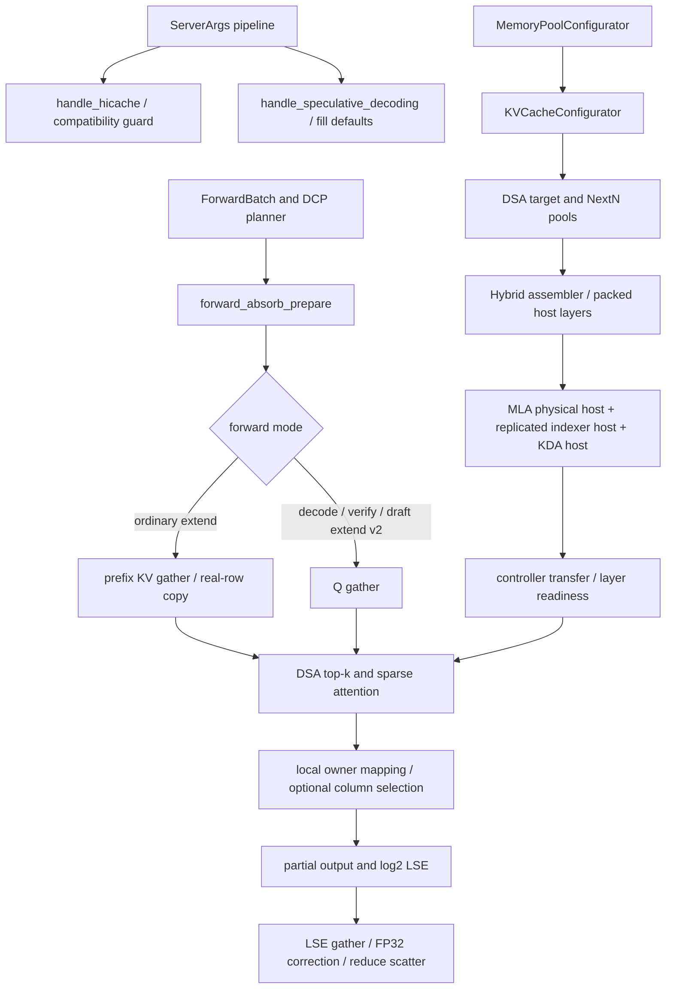

# DCP + NextN 在 S2 上的实现复核

2026-09-26，Codex 独立复核。对象固定为 `codex/dcp-mtp-stack2-n34` 的 `396225e7c0eb113ab48f853028b87d874de013b4`，基线 `submission/s2-0926` / `84dcca0e`。初审运行代码提交为 `e4d7ca68`；交付核对发现分支新增两项证据/文档提交后，已补审增量。两者的 `engine/sglang` tree hash 完全相同，见 [版本前进收据](../../evidence/review-dcp-mtp-20260926/head-advance.json)。本报告中的“最终分支”指 `396225e7`，不随分支后来移动而变更。

结论：新增的地址空间、NextN 阶段和 host 计费修正方向正确；发现并修复一处启动参数误拒绝。新增证据已补齐 TP2 缩模的受控接受长度 1/2/3/4、HiCache 恢复续算和 flush；不能据此宣称 TP8、真实完整权重或 N34/N38 已通过。S2 自身上一轮已发现的问题仍在这个提交中，不能因为 DCP 移植完成就视为已修复。

工作分支：`review/dcp-mtp-stack2-20260926`；工作目录 `build/worktrees/review-dcp-mtp-0926`。生产改动仅为 `b261cbd9` 的 180 参数守卫修正，另有回归与本报告。没有改作者分支，没有修改 Pod、使用 GPU 或终止任何服务。

## 范围与去重

| 最终提交 | 机制 | 审阅内容 |
|---|---|---|
| `01b3be05` | 115 | NextN latent 分片、indexer 容量、三个推测阶段、真实/补齐行数、迁移原语、可选 KPool 列裁剪、SM80 H32 布局 |
| `e4d7ca68` | 180 | packed NextN / DCP 准入、indexer host 逻辑容量、host 预算、传输字节 |
| `4ec0ff7e` | 诊断交付 | 冻结脚本/缩模配置/原始证据索引；补充 final-source TP2、受控接受、host restore/flush、high-loc graph 矩阵 |
| `396225e7` | 文档 | 共享 N30 计划引用修正 |

前两项运行实现提交合计 19 个变更文件，其中 13 个引擎源码文件；后两项为诊断、证据及文档交付，不增加运行代码。开发版 `aebaff56..f254c64f` 与最终版 `84dcca0e..e4d7ca68` 的引擎增删行逐项相同，已独立计算，见 [范围与函数清单](../../evidence/review-dcp-mtp-20260926/scope.json)。因此共同实现只读审一次；移植后的上下文另外核对。

S1/S2 的 37 项原有 patch 已在 `879216e8` 的 `notes/reports/review-s1s2-patches-0926.md` 复核，本轮不重复计算覆盖率或重复申报发现。可用 `git show 879216e8:notes/reports/review-s1s2-patches-0926.md` 查看。

源码审阅覆盖下列完整变更函数及关键上下游，不是仅对 diff 中的行下结论：

| 文件（均在 `engine/sglang/`） | 核查合同与上下游 | 判断 |
|---|---|---|
| `kernels/ops/attention/dsa/tilelang_kernel.py` | `tilelang_sparse_fwd` → v1 kernel 的头分块、共享内存、LSE 写出、空行 | H32 单 stage 修正有实际编译失败见证和 wrapper eager/graph 数值证据；不是单凭共享内存估算 |
| `srt/arg_groups/hicache_hook.py` | 完整 compatibility guard；pipeline 调用顺序；EAGLE 默认参数函数 | **D1：默认 topk 误拒绝，已修** |
| `srt/layers/attention/dsa_backend.py` | constructor、完整 extend/decode、top-k transform、TileLang wrapper、DCP 两种索引变换 | 列裁剪的前提成立；118 与 DCP 的拒绝守卫保留 |
| `srt/layers/dcp/comm.py` | planner 的真实行数 → prefix gather → extend copy；Q gather 与 LSE merge | 补齐行不再写进真实缓存；普通 prefix extend 仍有全前缀搬运热点 |
| `srt/managers/cache_controller.py` | D2H/H2D submit → ack 的字节统计 | 统计物理搬运字节，不改变 admission token 单位 |
| `srt/mem_cache/hybrid_cache/hybrid_cache_controller.py` | anchor、同索引 sidecar、独立 KDA 槽、packed layer 的 load/write 路径 | latent 除 W，indexer/KDA 不除 W；packed draft 已包含在各 host 池的层数中 |
| `srt/mem_cache/hybrid_cache/hybrid_pool_assembler.py` | packed 声明验证、KV/KDA 预算拆分、sidecar carve、真正的 host 构造 | indexer 按 W 倍计入物理 latent 行预算；不能把 host 总容量也重复乘 W |
| `srt/mem_cache/index_key_cache.py` | 全文件；页内 key/scale 字节布局、零槽、循环迁移、CPU copy | 新迁移按 token 在页内寻址；DCP 关闭仍保留底包路径，不能外推为树式 MTP 已修 |
| `srt/mem_cache/kv_cache_configurator.py` | loc-space scale、pool geometry、派生容量、实际 DSA factory、hybrid 旁路 | DSA draft latent 使用物理容量；indexer 构造器统一兜底很必要 |
| `srt/mem_cache/memory_pool.py` | MLA 构造/写入/读取/迁移，DSA 构造/压缩尾部/迁移；Unified MLA override | owner 规则一致；压缩 KPool 的不支持迁移在写入前拒绝；Unified 的物理页迁移保持独立 |
| `srt/mem_cache/pool_host/dsa.py` | 全构造与实际 load/write、page layout、父类 allocator/clear/destroy | indexer host 覆盖逻辑范围；`dcp_size=1` 继承值正确，不能改成 anchor 的 W |
| `srt/model_executor/pool_configurator.py` | target/draft cell 成本、skip-topk 层数、pool size 消费端 | latent 不重复乘 W；target/draft indexer 各乘一次 W |
| `srt/models/deepseek_common/attention_forward_methods/forward_mla.py` | phase predicate、完整 absorb prepare/core、最终投影 | DRAFT_EXTEND_V2 与 backend 的 partial-LSE 路由对齐 |

## Code graph 与手工核对的调用链

六组最终源码查询保存在 [codegraph-final](../../evidence/review-dcp-mtp-20260926/codegraph-final/manifest.json)。初期开发版的 graph 另存为 `codegraph/`，没有拿旧图冒充最终分支。

静态图的限制有实际例子：`loc_space_scale` 属性查询没有 caller；`IndexKeyCache.move` 被误连为自身；`DSAIndexerPoolHost.__init__` 的 callee 查询混入测试同名方法。因此用实际属性消费点、`DSATokenToKVPool.move_kv_cache`、assembler 和 controller 源码补齐，未把图中的“零调用”解释为死代码。

MTP 搬移的手工追踪：`_finalize_accept_tree_path` → `move_accept_tokens_to_target_kvcache` → pool move，仅 tree path 使用；另一个 caller 是分支草稿的 prefix-tail 拷贝，同样先检查 `topk > 1`。当前 topk=1 链式 NextN 无需 accepted-path compaction。不能把新 MLA mover 的 NCCL 测试当作压缩 KPool 树式草稿已被支持。

## 发现与修复

### D1 / P2：省略默认推测参数时，合法 NextN + HiCache + DCP 启动失败

位置：[hicache_hook.py](../../engine/sglang/srt/arg_groups/hicache_hook.py)，`resolve_hicache_dcp_compatibility`。

触发：GLM 单层 NextN、相同 draft 路径、DCP>1、HiCache 开启，省略 `speculative_num_steps/eagle_topk/num_draft_tokens`。`pipeline.py` 先调用 HiCache resolver，再调用 speculative resolver；此时 topk 是 `None`，旧守卫要求 `==1`，因此提前抛 `NotImplementedError`。实际 `_auto_choose_speculative_params` 对该架构返回 `(3,1,4)`。

修复只对原本已限定的同 checkpoint GLM 组合接纳 `(None,1)`，不提前写参数。显式树式 topk、独立模型、其他算法和不支持缓存布局继续拒绝。当前 W1/W2 实验脚本显式写了 3/1/4，因此这个 bug **不解释那些脚本的性能或数值结果**。

验证：[生产函数 AST 回归](../../scripts/tests/test_dcp_mtp_review.py)；[修复前](../../evidence/review-dcp-mtp-20260926/guard-before.log) 的 NEXTN/EAGLE × W2/4/8 六种默认组合均失败；[修复后](../../evidence/review-dcp-mtp-20260926/guard-after.log) 7 个 unittest 方法通过，包含原拒绝边界。这里只证明参数合同，没有假装运行完整模型。

### D2：初审发现的诊断交付缺口，已由新增提交关闭

初审 `e4d7ca68` 时，`notes/plan-dcp-8card.md`、`notes/reports/dcp-code-review-20260926.md`、新诊断脚本和证据未进入分支，文档存在悬空引用。`4ec0ff7e` 已将这些文件和分期归档清单提交，`396225e7` 修正共享计划引用。本项不再作为当前分支缺陷。

补审读取了接受注入器、比较器、缩模配置生成器、receipt 汇总器和 TP2 实际运行脚本，并核对 phase3 的原始接受事件、容量、host 命中、flush 及 trace。早期 [只读快照](../../evidence/review-dcp-mtp-20260926/author-snapshot/receipt.json) 保留作为初审轨迹；现行证据直接使用分支中已提交的 `evidence/dcp-mtp-20260926/phase3/`，无需再复制一套。

### 已知 S2 问题仍未进入最终分支

这不是新发现，也没有重复审计。最终分支从 `84dcca0e` 接入两项 DCP 实现及诊断交付，没有包含上一轮修复：

| 已有修复 | 与本候选的关系 |
|---|---|
| `bab21ddf` / 124 | 停放判断遗漏真实可准入资源、host load/页预算及同轮回退；当前准备脚本开启 124，相关问题仍可出现 |
| `07f8de24` / 180 | destroy 后 pinned owner view / staging 引用未清；反复建销池时仍可能保留内存，不应误称 DCP 新泄漏 |
| `7dbe80f9` / 117 | 有界形状元数据缓存尚未带入；主要省 eager host 开销，不能给 graph 热路径重复记收益 |
| `afdca82e` / 170 | capture/scatter 状态按实际 replay bucket 修正尚未带入；启用对应 prefill graph 时适用 |
| `93fcf134` / 128 | namespace、标识生命周期和 LCP 计算修正尚未带入；准备的 DCP 对照预期 128 关闭 |
| `67a00da8` / 110 | 显式关闭时保留真实模块的修正尚未带入；当前 110 开启的对照不以它归因 |

若要合并这些修复，保留一个新的冻结候选，再做同提交的 W1/W2 对照；不要把两侧源版本和开关混在一起。

## 正确性细节与证据边界

**地址单位。** 逻辑 loc `v` 的 owner 是 `v % W`，本卡 latent 行是 `v // W`；indexer 保持逻辑地址。DSA constructor 的最低 indexer 容量 `(size+page)*W-page`，加上 `IndexKeyCache` 自己分配的 padding page，覆盖 `(size+page)*W`。这个修正在实际 constructor 中，能覆盖绕开单独 DSA factory 的 hybrid target。

**HiCache。** anchor 的 `size/page_size` 是物理单位，`logical_size=size*W` 是控制器可见单位。indexer 继承 `dcp_size=1`，容量却取 anchor 的 logical size，正是复制式布局；把它也除 W 会漏存。packed target/draft 的层数已进 `size_per_token`，ack 再加一次 draft 会重复计费。KDA 按状态槽计数，不随 DCP token 分片。

**真实行与补齐行。** planner 按真实序列总长度分配 buffer，TP collective 可能补齐 K 的第一维；只复制真实 suffix 行数正确。该修复与高虚拟地址溢出是两个不同问题。`k_pe=None` 在 GLM 零 rope 路径有效，短于实际 token 数的输入仍报错。

**列裁剪。** KPool 先按组展开四个连续 token，再追加从整组边界开始的尾部；page 对齐使列号与虚拟 loc 在 `gcd(W,4)` 下同余。按该同余类取列之后仍做 owner mask，W8 不能去掉这个 mask。裁剪发生在 64 列 padding **之前**，padding 由 wrapper 补齐。任意非分组 top-k 列表不满足此合同。

**数值与图。** TileLang 使用 log2 LSE；`forward_mla` 的默认 DCP merge 按匹配的底数做 FP32 correction，再 reduce-scatter。空 owner 行的 attention 输出需清零，保留其无权重 LSE；不能把全局 `nan_to_num` 当作有效输出总会有限的证明。作者 sparse probe 额外检查非空行有限值，值得保留。

作者证据逐项核查如下；没有把这些旧记录改名为本轮新 GPU 实测：

| 证据 | 独立核查到的事实 | 不支持的结论 |
|---|---|---|
| `phase2/compare_mtp4_strict.json`、graph 对照 | 每臂 504 个观测、输出 token 相同，最大观测相对 L∞ 约 0.007576；每个请求 histogram 均为 `[11]` | 只覆盖自然接受长度 1，不覆盖接受长度 2/3/4 |
| `mtp_graph4/summary.json` | draft decode、draft extend v2、target verify 均有重放记录 | 不代表 TP8 graph 已跑过 |
| `mtp_dcp4/capacity_target0.json` | logical capacity 65536，但 target indexer 仍为 513×64 行；这是 constructor 最终修正前的低地址模型运行 | 不能写成最终 indexer 容量、高地址续算已经通过 |
| `host_gpu7b` / 本轮 CPU host suite | 实际池构造和控制器的 W2/4/8 高地址、毒化、异址拷贝合同 | 不等于真实权重恢复后继续生成；W4/W8 单 rank 模拟也不等于真实通信 |
| `sparse10.json` | 18 个局部 attention/LSE/graph case、6 组边界检查（各 21 长度）、最大逐行相对误差约 0.007752 | 不包含 TP8 collective、完整模型或 SLO |

`sparse10` 的 kernel 与 KPool 三个依赖文件哈希和最终分支一致；`dsa_backend.py` 整文件哈希不同，因为 S2 加入 118。已核对两项 DCP helper 的 AST 相同，并阅读 118 初始化和 dispatch 的差异；当前 prepared jobs 明确关闭 118。不能只用“整文件不同”否定 helper 证据，也不能据此宣称整个最终服务经过同条件数值验证。

本轮额外用 [独立 trace 复算器](../../scripts/analysis/audit_dcp_mtp_traces.py) 检查保存的每个采样行、元信息、文件完整性及 graph 标识：[eager 复算](../../evidence/review-dcp-mtp-20260926/mtp_dcp4-recheck.json) 和 [graph 复算](../../evidence/review-dcp-mtp-20260926/mtp_graph4-recheck.json) 各 504 项通过，最大逐行相对 L∞ 均为 `0.0075757578`。graph 的三类推测阶段逐条都有非空 graph key/replay id；eager 对照本来不要求 graph。每个原始 `.pt` 的路径和 SHA256 均在复算 JSON 中。它只读 CPU，不运行模型。

### 新增 phase3：最终源码 TP2 证据的独立复算

phase3 的 `fix5` 源码收据核对了 4697 个引擎文件，匹配 `e4d7ca68`，与 `396225e7` 的运行 tree 相同。target/draft 的 W2 indexer 都为 1026×8448 B/层，覆盖 65536 个 allocator 逻辑 token 加 padding；旧 phase2 的容量缺口已补上。这里运行的是 TP2、缩小层数、dummy 权重模型，保留 NextN 的 BF16 排除项；不是完整真实权重验证。

我重新读取作者开发机的原始 `.pt`，四组全部通过。逐行相对 L∞ 门槛为 0.01；输出 token、输入元信息、文件集合和三类推测图重放标识同时核对。

| 对照 | trace 对数 | 最大有效行相对 L∞ | 独立复算 |
|---|---:|---:|---|
| 自然接受，W2 / W1 | 504 | 0.0075187972 | [natural.json](../../evidence/review-dcp-mtp-20260926/phase3-recheck/natural.json) |
| 受控接受 1/2/3/4，W2 / W1 | 264 | 0.0073529412 | [acceptance.json](../../evidence/review-dcp-mtp-20260926/phase3-recheck/acceptance.json) |
| W2 列裁剪开 / 关 | 264 | 0 | [compact.json](../../evidence/review-dcp-mtp-20260926/phase3-recheck/compact.json) |
| HiCache 模型恢复，W2 / W1 | 756 | 0.0075187972 | [host.json](../../evidence/review-dcp-mtp-20260926/phase3-recheck/host.json) |

这 1788 对与旧 phase2 的 1008 对分开留证。新版 probe 保留 draft extend 的被拒绝行；本次从 `accepted_tokens`、窗口宽度、前置 token 数和采样行号**独立重建**有效行 mask，再核对记录的 mask。源码中 draft-extend logits/hidden/indexer seed 由 `accept_lens-1` 选取，KPool 的写计划也用 `num_accept_tokens`，因此拒绝行不进入有效数值判定；其差值另记 `all_rows_max_abs`，没有删掉原始行。该判定不能外推到未经核对的其他输出消费者。

[接受与恢复复核脚本](../../scripts/analysis/audit_dcp_mtp_receipts.py) 另从原始 JSONL 检查 oracle 的 SHA256、受控 proposal 的匹配/故意不匹配位置、真实 verifier 输出、每个 case 的 1/2/3/4 覆盖和 owner 余数。每臂每 rank 有 20 个受检 round，另有 4 个尾部 round 越过保留参考窗口，不计入。W2 的受检窗口覆盖 owner 0/1，但实际跨 256/512 虚拟地址边界的窗口数均为 **0**，不能把“有长前缀”写成接受窗口跨页通过。

HiCache 从真实响应检查 device 4096 → host 4096、32×4096 token churn、相同输出及 flush 后 cached_tokens=0，并独立比较同臂 device-repeat / host-restore 的原始 trace：W1/W2 各 126 对通过，最大有效行相对 L∞ 分别为 0.0031250000 / 0。详见 [收据复核](../../evidence/review-dcp-mtp-20260926/phase3-recheck/receipts-audit.json)。作者 phase3 原始归档 50,073,526 B 的 SHA256 也独立复核一致，见 [归档检查](../../evidence/review-dcp-mtp-20260926/phase3-recheck/raw-archive-check.json)。

`high_graph13` 记录 ordinary target 路径的虚拟 loc 53759/55484，均高于 32768 物理容量，含 8 次实际 graph replay。它关闭了 MTP，不能称为“高地址 + NextN + 受控接受”的组合覆盖。受控接受与 host restore 也是两个分开的诊断，probe 明确禁止组合运行；接受长度 2/3/4 与 host 恢复叠加仍待测。以上都没有自然接受率或服务性能结论。

## 本轮独立验证

55 项真实 host-pool/controller/tree CPU 测试通过，加上 7 项启动参数回归，共 62 项。CPU suite 只替换底层 CUDA 字节 mover 和锁页调用；实际构造、页单位、打包层、写读控制器和树逻辑照生产代码执行。运行源码共 4713 个文件逐项核验，零不符，见 [源码收据](../../evidence/review-dcp-mtp-20260926/source-verification.json)、[命令收据](../../evidence/review-dcp-mtp-20260926/cpu-review-receipts.json) 和 [完整日志](../../evidence/review-dcp-mtp-20260926/host_cpu.log)。使用开发机现有 Python 环境，`CUDA_VISIBLE_DEVICES=""`、`HC180_DEVICE=cpu`。

新增 [容量/传输核算](../../scripts/tests/hicache180/test_180_dcp_accounting.py) 从真实 tensor backing storage 核预算，从 tensor 形状核传输字节，覆盖 W1/2/4/8 和 packed draft。1 GB/卡配置的实际 host backing 分别为 1,000,084,832 / 1,000,266,208 / 1,000,039,600 / 1,000,255,712 B，整页舍入超量最大约 0.027%。这只计数据 backing，allocator metadata、device staging 与进程其他内存另算。四个物理 MLA 页加对应 indexer 的传输字节分别为 1,183,744 / 1,318,912 / 1,589,248 / 2,129,920，与 ack 统计完全一致。

首轮新测试把 MLA `page_first` 的首维误当成页，导致测试期望值少乘 page_size；已修正为实际的 token-major layout，并重跑完整 suite。初轮日志和测试版本留在证据目录，明确属于测试编写错误，没有列为引擎 bug。

新增报告和 115/180 当前文档的相对链接均经检查；初审缺失链接保留在 `document-link-check-v1.json`，更新后的 [检查收据](../../evidence/review-dcp-mtp-20260926/document-link-check.json) 对应 D2 已关闭。

## 值得继续做的具体优化

以下是实现机会与可验证的收益来源；除注明作者局部实测外，均为代码推断，不是已经获得的端到端收益。

### O1：让长前缀、短 extend 避免每层收集全部 prefix KV

`forward_absorb_prepare` 的 ordinary extend → `all_gather_kv_cache_for_mla_extend`，即使只新增几十/几百个 token，仍按整段命中前缀 gather。以 128 Ki token 前缀、512 BF16 latent 为例，单层生成 128 MiB 的完整 prefix buffer；11 个目标 DSA 层合计 1.375 GiB 的 materialization，若执行 NextN 普通 extend 再加 128 MiB。这是字节账，buffer 逐层复用，**不是同时常驻 1.5 GiB**。

建议给短 extend 增加 Q gather + owner-local sparse attention + LSE merge 路由，沿用当前三个推测阶段的数值协议。长块保留现有路由。只按 ring payload 粗算：本卡 h 个 Q 头、W 个 DCP rank，Q 的 BF16 gather 加 FP32 output reduce-scatter 与 prefix gather 的分界约为 `prefix_tokens > 3*W*h*extend_tokens`；TP8 的 h=8 时是 `P > 24*W*T`。它忽略延迟、kernel 成本和通信实现，只适合作为扫描形状的起点。

对 fast/turn/overall 最直接；验证需要同请求 P/T/batch、真实 NCCL 时间、DSA o_proj 输入误差、HiCache 恢复后的短尾、MTP 和非 MTP。不能把所有 prefill 无条件切成 decode 方案。

### O2：先去掉 prefix gather 中可证明多余的工作

现路径每层将 CPU prefix lengths 转 tensor，做 padding 计算，按请求分配/拷贝，再 cat、all-gather、重排、再次 cat，最后复制到 planner buffer。planner 的常规前缀本来已按 widened page 对齐。

可先做两个较小改动：所有 prefix 为零时跳过缓存读取与空 collective；所有 starts 为零且 lengths 整除 W 时跳过通用逐请求 padding/reorder，仅保留必要的 rank interleave。将这个判定在 batch metadata 中算一次。随后再考虑 fused interleave 直接写 planner buffer，减少大张量往返。

必须保留非对齐 chunk/MHA 调用的 fallback，覆盖混合零长、多请求、零 rope、FP8 raw-byte transport，并确认每个 rank 对空 collective 的分支一致。冷 chain 的固定开销和长前缀 warm 时间分别量，不预报毫秒收益。

### O3：减少 indexer 的空页搬运，再考虑紧凑存储

`compute_pooled_write_locs` 用每组四个 token 页中的第一页放 64 个压缩 key，其余三页 indexer 空着；当前设备池/host 池都保留完整页地址，HiCache 也全页搬。

优先尝试在完整 256-token 所有权组下仅传有效组头 indexer 页，减少该组成的约 75% DMA 字节；验证页描述符、分叉、目标和草稿、slot reuse、写穿在途及恢复后的前向。再考虑独立 indexer 页映射压缩 allocation。**不能直接把 `index_buf_size` 除四**：物理 token 页可不连续，现有地址仍按原页号寻址，会碰撞或越界。所有写 kernel、pooled page table、HiCache、pool profiler 必须一起改。

按 11 个目标 DSA + 1 个 draft、各层均有 indexer 的假设，每卡每逻辑 token 字节账如下（不含 KDA/权重/临时缓冲）：

| W | 当前 `12*(1024/W+132)` B | 若 indexer 真正紧凑到 1/4 | 同 KV 预算容量上限改善 |
|---|---:|---:|---:|
| 1 | 13872 | 12684 | 约 9.4% |
| 2 | 7728 | 6540 | 约 18.2% |
| 4 | 4656 | 3468 | 约 34.3% |
| 8 | 3120 | 1932 | 约 61.5% |

这是组件算术上限，**不是 N@SLO 提升比例**。开启 skip-topk 时应按实际有 buffer 的层重算。先看真实 miss/eviction 与 KDA slot 是否限制命中，避免扩出用不到的 KV。

### O4：把列裁剪和 owner 映射移到 top-k 生产端

当前 helper 在每层产生多个 Torch elementwise kernel：取余、有效位、整除、where/cast，wrapper 还可能 cat padding。可在 KPool top-k transform 生产端直接写本 rank 的 int32、已 padding 索引；保留 IndexShare 的原始索引合同，别悄悄让公共 top-k 输出变成 local row。

W8 只按 `gcd(8,4)=4` 取列，剩下的仍可能约有一半属于另一 owner。进一步可做行内 compact + valid-count，使 attention 跳过空 block，但必须保留最坏容量：被选 group 的奇偶分布没有保证，不能直接把输出容量砍成 1/8。固定 graph buffer 加每行有效长度比较合适。

作者局部 graph 计时包含映射与 padding，T136/152 的 W2 约 0.267–0.325 → 0.156–0.190 ms，W4 约 0.408–0.411 → 0.131–0.148 ms，W8 约 0.690–0.694 → 0.214–0.236 ms。它支持当前列裁剪有局部价值；不支持这些倍数直接转成 TPOT 或整档收益。

### O5：按完整 DCP step 选 kernel/通信组合

H32 单 stage 是解决 A100 无法启动的正确修复；还需比较 H32/H64 的 head block、stage 数与 query rows，包含短 decode、4×batch verify 和 draft extend。评估应计入 Q gather、LSE gather、FP32 correction、reduce-scatter 及最终投影。只优化 sparse kernel 可能被通信抵消。

当前 MLA mover 的逐层 NCCL 不在 topk=1 热路径，不应优先做它来宣称 TPOT 改善。也不要为了通信字节把 FP32 correction 改为 BF16 而省略精度对照。

### O6：给 124 的服务估算加入 DCP 的真实成本

S2 `ax_deadline.service_s` 仍使用 run071 的固定开销、每新增 token 成本，忽略 prefix 长度与 DCP 宽度。DCP ordinary extend 的全前缀通信会让相同新增 token 数的两条请求耗时很不一样；当前“可救/不可救”分类因而可能偏差，影响 turn/fast 的等待和 cold 停放。

先记录 `W、prefix、extend、batch、host_restore_bytes、预填充耗时、当前 decode 负载` 的有界观测，用真实 run 拟合/分桶。排序决策继续由 TP0 产生并广播。先修已有 124 可准入资源问题，再调估计；沿用旧 68us/token 不能证明新 DCP 调度合适。

## 验收边界和下一次实验

1. TP2 缩模的三个推测阶段图、受控接受 1/2/3/4、HiCache 恢复续算和真 flush 已闭合，保留上表证据；向 TP8 和完整真实权重迁移时需要重新验证，不能以本次通过替代。
2. 补齐组合边界：高虚拟 loc 的 target/draft 真正 NextN 续算、混合 batch、host 恢复叠加接受长度 2/3/4，以及实际跨 256/512 边界的接受窗口。当前 owner 交错证明不能替代页边界覆盖。受控 proposal 只验证 verifier/state commit 合同，不能拿它测自然接受率或服务性能。
3. 先带入已有 124 可准入资源修复；按实际启用机制选择上一轮其他修复。当前候选仍从未经这些修复的 S2 出发，DCP 数值通过不能排除其服务层风险。
4. 再做同一提交、同一 workload、相同 MTP/调度/host64/418 KDA 槽的 W1/W2；118 关闭且记录 compact-topk 的有效 stride。W1/W2 的完整组合才能相互比较。
5. N34 的 60 分钟窗口加 drain 只能作诊断；完整档仍需原 harness、cohort 完整且每条请求恰好一次、所有门和正式排序口径。逐请求区分 chain/turn/overall/fast 与 TPOT 超线，不从局部加速倍数外推名次。

以上未闭合项没有被本次静态审查标为运行失败，也没有被 CPU 或旧 TP2 证据替代。
