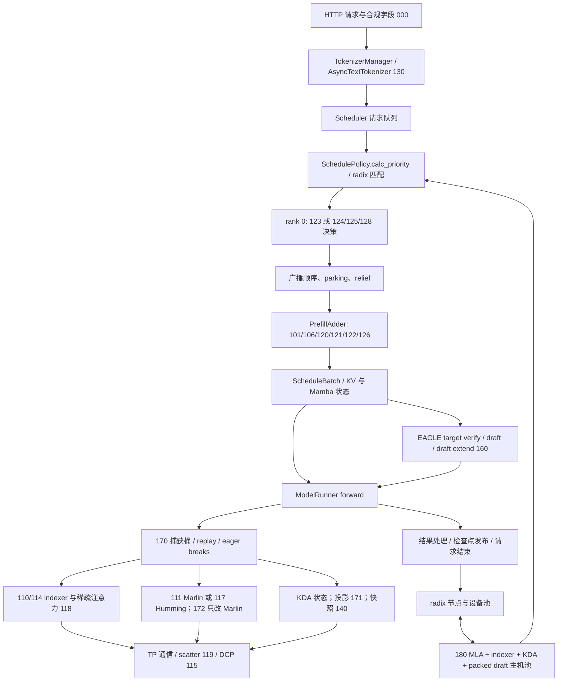

# S1/S2 相对 SGLang 底包的逐提交审查与优化

日期：2026-09-26。作者：Codex。分支：`review/s1s2-patches-0926`。
状态：代码修正、CPU 验证与针对 117/180 的单卡验证完成；未取得本轮 TP8 / 完整回放成绩。
本报告尚未由另一位参与者复核，不能据此替换正式部署基线。

## 1. 范围与结论边界

固定底包 `engine-base=e7dab838b4c025e5ab5acf16ddac8f4c2889a9e8`；
S1 `4f9d1f0b9c71522ad8e97413924baf513e6f4357`；
S2 `84dcca0ed84f949cf44acd0a5d2427b171d317a2`。
S1 是 S2 的祖先，因此公共部分只审核一次。并集共 **37 个引擎提交、61 个有差异的源码文件，+5195/-403 行**。
S2 独有变化是 124 的 warm 等待阈值，不能把 S1/S2 名字当作不同的整套执行引擎。
逐提交清单、源码 SHA256 与 S2 独有 diff 在 [inventory.json](../../evidence/review-s1s2-patches-20260926/inventory.json)。

审查单位是完整改动函数及其上下游契约：入口与开关、请求与 batch 状态、预算、缓存所有权、真实 forward、
图捕获/重放、拒绝与销毁。Code graph 用于定位依赖，动态派发、monkey patch 和注册路径另行对照源码。
这不等于对全部 SGLang 文件作了无遗漏证明，也不把已有测试通过当作“没有 bug”。

已实现六组机制修正：110 的显式关闭语义，124 的可行性与 parking，128 的命名空间与前缀计算，
117 的 shape 元数据缓存，170 的逐桶布局，180 的主机池销毁。未改模型输出约束，未缩减历史、工具或 thinking。
这些改动在独立 worktree 中；本轮没有部署到共享 8 卡 Pod。

正式目标按 `task.md`：先 `n_at_slo`，再 `tpot_mean`；TPM 仅回报。
下面的局部时间、历史共同 ID 对照均不能外推本轮的整档提升。

## 2. 已修正的问题与实现细节

### 110：显式关闭不能仍给底包补入替代函数

`_install_on_module` 先给真实 DeepGEMM 模块装 dispatcher；当原始属性缺失时，dispatcher 的
`_orig is None` 分支会选用本地实现，即使 `SGLANG_AX_SM80_INDEXER=0`。
普通的“底包函数存在”用例只验证了调用结果，漏掉模块属性被替换和缺失 API 被静默补齐。
现显式关闭时完全跳过安装，保留原函数身份、缺失属性与底包 import error。开关仍是启动配置。
active sm80 数学路径没有改变。另修正文档：`CHUNK_BYTES` 在当前 112/113 只被读取，
不控制完整 logits 分配，不能用它作为显存安全上限。
实现：[sm80_deep_gemm.py](../../engine/sglang/srt/layers/attention/dsa/sm80_deep_gemm.py)。

### 124：避免“决定让路，实际无人能进”的空轮

原实现以待算 token 数同时近似计算预算和 KV 预算。两个反例在 S2 上均复现：

- waiter 新算 1024、可用 KV 1250：忽略输出预留与页开销而 park，native adder 随即返回 `NO_TOKEN`；
  这一轮空转。关闭 124 时，同一续算请求还能前进 1024 token。
- waiter 命中 host 65536、新算 1024、device 余量 8192：计算很短，回载的前缀仍要占 device KV，原计划同样误 park。

现将 native 完整请求预算提为 `PrefillAdder._request_total_tokens`，parking 只读预览复用它，
包括待驻留 KV、剩余输出预留、页开销和共享 Mamba 成本。先确认请求槽，再在排名前 64 项中寻找可整轮完成者；
被选中者随 rank-0 决策广播到队首，避免前面的不适配 host hit 触发 `NO_TOKEN` 后遮住它。
预览不执行 COW、锁定或回载。实际重匹配、锁和 adder 仍有最终决定权。

若最后没有 waiter 入选，经过 native 拒绝清理后，**同一调度 pass 恢复原续算**，使用当时的真实 KV 余量；
余量归零则沿用 106 安全延期。`parks` 和连续 parking 计数只在有 waiter 真正执行时增加。
不会把预览成功直接当作已获得资源，也不会创建第二个 partial prefill。

### 124：warm 请求不应受错误的 cold 块预算限制

在 round=8192、cold cap=6144、short=8192 下，device 命中 65536、新算 7000 的 warm 请求可以整轮完成，
原 parking 判断却用 6144 拒绝它。现按 waiter 类型区分预算，device short hit 使用整轮预算；cold 仍保留保守上限。

S2 的 `MAX_WAIT_WARM_S=10` 只改变队列优先级；等待 11 秒、slack 已负的 warm 请求仍被 `should_park` 拒绝，
因而“排第一”未兑现为让路机会。现排序和 parking 共用 `is_starved`：资源可容纳时，饥饿请求可越过负 slack 条件。
8 轮 / 2 秒的连续 parking 限制仍有效。因此这个参数是优先服务阈值，**不是无条件的 10 秒服务保证**。

实现：[ax_deadline.py](../../engine/sglang/srt/managers/ax_deadline.py)、
[schedule_policy.py](../../engine/sglang/srt/managers/schedule_policy.py)、
[scheduler.py](../../engine/sglang/srt/managers/scheduler.py)。
反例：[probes.json](../../evidence/review-s1s2-patches-20260926/probes.json) 的 F1–F3。

### 128：家族要服从真实缓存命名空间，避免长前缀的成对扫描

原家族算法只比 prompt，不检查 `cache_salt` 和 `extra_key`；不同 namespace 的同文请求被当作可复用家族，
降低 leader 的排序工作量并延后 rider。真实 radix 匹配仍隔离 namespace，故这里是错误排序和空等，
没有证据证明实际 KV 串租户。现分 namespace 建家族。

原实现每对请求都在 Python 中扫描长 block-hash 前缀。现对每个 namespace 排序 hash 序列，
只计算相邻的 n−1 个 LCP，用“区间相邻 LCP 的最小值”等于两端 LCP 填充 pair 缓存。
复杂度中的 Python 长前缀循环由 O(n²·L) 降为 O(n·L)；成对填表与分组仍是 O(n²)，排序也有比较成本。
prompt 只按固定大小切片转 tuple 求 hash，避免先构建整条 int64 数组。

只有成员、请求身份或 namespace 改变才补算/失效 pair；复用 RID 不会继承旧 LCP。
请求身份用小型唯一 token，避免 `id(req)` 地址回收后重用，也不在成员表中持有整条旧 prompt。
超过 64 候选仍回退 124；flush 同时清 pair 与成员状态。保留哈希的启发式性质，实际缓存命中仍由 radix 决定。
CPU 测试逐对与朴素 LCP 对照，覆盖顺序变化、复用 RID、改 namespace、flush 和缓存重复调用。

### 117：减少每层 forward 重建 shape 字典

真实调用是 `Fp8HummingMoEMethod.apply → HummingRunnerCore.run → prepare_buffers → make_workspaces`。
`get_buffer_metas` 在一次 forward 内调用两次，构造相同 shape/dtype 字典。
新增 117 专属 runner 子类，按输入形状、top-k 形状、GEMM 类型、expert 数、K/N、a/c dtype 缓存，
每层最多 64 项；连续相同 key 直接取上一项，省去 Humming dtype 的重复 hash；符号形状走原方法。
检查了 `_workspace_shapes` 与 `prepare_buffers` 的完整消费路径，均只读元数据。

缓存不持有 tensor 或 CUDA workspace，原分配、权重转换、计算和 combine 路径继续执行。
这不是永久预分配 MoE 中间张量，不能把先前 Marlin→Humming 的大幅收益记到本次小修上。
实现：[fp8_humming_moe.py](../../engine/sglang/srt/layers/quantization/fp8_humming_moe.py)。

### 170 + 119：捕获布局必须按 graph 桶保存

原 `_ax170_capture_input_scattered` 是单个布尔值。若阈值为 1025、按降序捕获 4096 和 1024，
最后的小桶将它覆盖成 false，合法的大桶因此全部回退 eager。已复现的是**错误回退/丢失加速**，不能夸成新发现的数值错误。

现保存 `{capture_num_tokens: scattered}`；`can_run_graph` 与 `load_batch` 共用实际桶选择函数，包括 CP 选桶。
缺失或布局不匹配仍回退 eager。没有放宽 padding 或通信安全条件。
“padding 本身导致本例错误”和“每轮保留旧 KDA snapshot”两个初步怀疑，在读完 static batch 重建和外层 forward 后撤回。
实现：[prefill_cuda_graph_runner.py](../../engine/sglang/srt/model_executor/runner/prefill_cuda_graph_runner.py)。

### 180：销毁 backing tensor 时也要释放其视图

原 `destroy` 注销并清空 owner 属性，但 `layer_first` 的 `index_k_data_refs` 仍引用其存储；
只要 pool 对象还活着，整块 host allocation 就可能继续保留。指针表和 page-first staging 也留在对象上。
现一起清除这些引用，维持先注销、后释放和重复 destroy 的幂等性。
设备原始缓冲由设备池持有，不随 host sidecar 被误释放。
这修正池生命周期的资源滞留；没有将其标成正常请求路径的 TTFT 收益。
实现：[dsa.py](../../engine/sglang/srt/mem_cache/pool_host/dsa.py)。

## 3. 本轮验证与测量

[CPU 回归日志](../../evidence/review-s1s2-patches-20260926/optimized-tests.log)：**154 项通过**，
其中原有六组调度测试 129 项、新增针对上述反例与生命周期的 25 项。
使用真实生产方法 AST，Req、pool、时钟和 forward 为测试替身；两 rank 用例模拟广播，不是分布式进程验证。
日志内原有的模拟 TPOT 数字属于 fake cost model，不能作为实机成绩。

[最终配对 CPU 测量](../../evidence/review-s1s2-patches-20260926/optimized-cpu-benchmark-final.json)：
同进程交替 A/B，家族每档 5 组、每组重复 20 个缓存轮，报告中位数；每请求 250000 token，
共同前缀 249000，尾部 1000 各异。请求构造不计时，输出家族结果必须一致。

| 候选数 | S2 首轮 ms | 修正首轮 ms | S2 缓存轮 ms | 修正缓存轮 ms |
|---:|---:|---:|---:|---:|
| 8 | 22.765 | 13.142 | 0.0171 | 0.0184 |
| 30 | 92.735 | 51.859 | 0.1757 | 0.1815 |
| 64 | 227.773 | 108.277 | 0.7580 | 0.7424 |

30/64 个超长共享 prompt 的首轮约减少 44%/52%；8/30 请求的缓存轮略有增加，绝对约 1.3/5.8 µs。
这里是合成共享形状的本地 CPU 观测，不能换算成 TTFT 百分比。
Humming 的 shape 替身测量中，每对元数据调用 2.069→0.687 µs。最终 CPU 计时与单元测试串行执行；
早期 `optimized-cpu-benchmark.json` 保留迭代收据，以下只用最终源码的结果。

开发机 **GPU0，A100-SXM4-80GB，Torch 2.13.0+cu130，Humming 0.1.12**。
按用户授权停止 GPU0 上的原服务及只负责 GPU0 的重启循环，自己的测试顺序执行后全部退出；未操作 8 卡 Pod。
来源、依赖与源码 SHA256 见 [GPU provenance](../../evidence/review-s1s2-patches-20260926/gpu/provenance.json)。

**117 数值和图验证：57 项检查通过。**
[最终日志](../../evidence/review-s1s2-patches-20260926/gpu/moe-validation-v3.log) 使用随机 block-FP8 权重，
真实 `FusedMoE.weight_loader/forward`，按 TP8 每卡形状 E=289、K=4096、N=256、top-k=9 在单 rank 执行。
覆盖 M=1/32/128/2048/8192、clamp 重输入、shared expert / routed scaling / 错位 scale 的负对照；
Humming 对 FP32 参考的相对 L2 误差最大 0.00628，均通过原测试阈值。
M=1/8/32/64/128 的两轮新输入 graph replay 在 Humming/Marlin 两路通过。
关闭 117 后与 S2 的 `fp8.py` 权重及固定 routing alignment 的输出逐位相等。
自由 alignment 仍有原有重复性差异，不能说所有运行逐位确定。
这里的 MoE graph 检查**不是 170 整模型图验证**；没有真实模型权重、TP8 collective 或 MTP 接受率结论。

**117 元数据缓存实测。**
[7 轮交替 A/B 原始记录](../../evidence/review-s1s2-patches-20260926/gpu/humming-cache-v2.log)
在同一个真实 Humming layer 切换原版/缓存版 `get_buffer_metas`，其余权重、分配和计算路径相同；
每轮 10000 对 metadata 调用及 40 次 eager layer forward，wall time 包含同步。

| M | 原版 metadata 对 µs | 缓存版 µs | 原版 layer ms | 缓存版 layer ms |
|---:|---:|---:|---:|---:|
| 1 | 27.619 | 3.325 | 0.5708 | 0.5074 |
| 128 | 27.616 | 3.351 | 0.6518 | 0.6594 |
| 2048 | 27.442 | 3.482 | 1.2614 | 1.2635 |
| 8192 | 27.400 | 3.462 | 3.4707 | 3.4877 |

元数据成本下降约 87%–88%；M=1 eager 整层在本次配对观测中减少约 11%。
M≥128 的整层没有体现加速，中位数反而高 0.2%–1.2%，原始样本有波动；不能宣称大 prefill 或 graph decode 获益。
graph replay 不执行这段 Python。此测试峰值 `torch.cuda.max_memory_allocated()` 为 3070661120 B，
不是 GPU 总使用量、也不是引擎额外常驻显存；新增缓存只保留 host shape 元数据，每层最多 64 项。

**180 生命周期：三种 layout 各重复三次，9 项通过。**
[最终日志](../../evidence/review-s1s2-patches-20260926/gpu/host-lifetime-v2.log) 使用真实 CUDA device pool、
`cudaHostRegister/Unregister` 和 pinned host allocation，验证 unregister 恰好一次、重复 destroy、
owner/view/staging 的弱引用释放，同时设备池原始 tensor 保持有效。
探针每个 host allocation 为 4359168 B；page-first 另有 2162688 B staging，均释放。
这是小池生命周期验证，不是完整异步 HiCache 回载或正式 host 容量测试。

保留失败记录以说明修正过程：首轮 MoE 因缺 `libnvrtc-builtins` 未进入有效测试，
在 launcher 加入现有 CUDA 的真实 lib 路径后通过；首轮生命周期探针因测试 spy 的 `call_args` 自己保留 tensor 而失败，
释放 spy 后同一生产修正通过。旧 117 测试退出时的 NCCL teardown warning 保留，进程已退出。
110 开关、124 准入、128 家族和 170 桶守卫在本轮只有上述 CPU 验证；完整 TP8 模型和正式回放仍待进行。

## 4. Code graph：把局部改动放回实际链路

[原始查询收据](../../evidence/review-s1s2-patches-20260926/codegraph/manifest.json) 基于冻结 S2，
codegraph 1.6.0。以下图含人工补齐并验证的动态调用，不是工具输出原样拼接。



重点跨文件约束：

1. `calc_priority` 的匹配用于排序，`Req.init_next_round_input(tree_cache)` 在正式准入再次匹配，
   `add_one_req` 加锁后还会复核预算。故排序时“看起来能进”不能替代执行时检查；parking 要有失败恢复。
2. 128 的共享前缀必须符合 radix namespace 和检查点网格；只有实际发布进树的 KV/状态才能复用。
   leader 的排序工作量折扣不是物理减少 GPU 工作量的证据。
3. 170 的 capture 直接进入内层模型，replay 还有外层 eager 处理；119 的布局决策必须在两边一致，
   且按最终选择的 bucket 核对。KDA/indexer 的 eager break 不等于整轮没有 Python 开销。
4. 160 的 draft 也是 FP8 MoE/DSA 消费者；切换 117、115、180 都可能影响其数值或状态，
   不能只测 target prefill 就宣布 MTP 兼容。
5. 180 的 sidecar 必须与 MLA token 页、完整 256-token group、KDA 状态位置和 packed draft 同步。
   一个组件字节正确，不能推出整个恢复检查点正确。

工具限制也已核验：`Fp8HummingMoEMethod.apply` 的 `.run` 被静态图误连到无关 receiver；
`fp8_mqa_logits` 通过 monkey patch 接入，caller 查询漏掉 kpool 路径；
部分 `can_run_graph`、异步 tokenizer caller 为空或只出现自身。因此空 caller 不作为 dead code 证据，
静态边不直接作为工程结论。

## 5. 37 个提交的覆盖账本（公共提交一次）

这张表记录每个提交审查的主要契约及结论；有些机制在后续提交中被修正，因此最终行为以 S2 合并状态为准。
“未发现新增缺陷”只限已读的 patch 与调用路径，不代替未完成的 GPU/分布式验证。

| 提交 | 机制 | 实现层审查重点与结论 |
|---|---|---|
| `da281c67` | 000 | HTTP/usage/flush 的接口语义；flush 必须真正清设备、主机与每档统计，不能只归零表面计数。继续保留原 harness。 |
| `0ae3be67` | 101/105 | 角色边界向检查点网格取整、最后一块拆分、已有 partial 时禁止第二次拆分；收益受额外前向与 KDA 槽代价约束。MTP 路径关闭此机制。 |
| `7da95c6e` | 106 | KV 不足时保留续算所有权并延期，避免强塞整块；本轮 parking 回退沿用这条路径，零 KV 用例通过。 |
| `96fc86d3` | 110/112/113 | FP8 软件解码、BF16 dot、FP32 logits、ragged/causal mask、paged/ragged decode 地址；本轮修复显式 off 仍装 dispatcher 的边界；大临时张量与完整 K gather 是优化重点。 |
| `8f4e4c5e` | 111 | FP8 repack/scale、shared expert、clamp、router scale、workspace 与 combine。缺少 `expert_map` 本身不是已证实 bug：上游 dispatcher 已转换路由索引。 |
| `cf7e00a5` | 114 | 按查询行分片、尾行补齐、local 结果 gather 顺序；目前 gather 已展开 token 索引，存在可量化通信压缩空间。 |
| `bdeca5c3` | 120 | 原续算先计费、仅完整 device short hit 可插入、轮预算/请求槽/状态所有权；跨 HiCache 总开关由 180 后续修正。 |
| `179eb466` | 121 | 即使 waiting 为空，只要仍有 decode 也压 cold 块；tradeoff 是 MoE 大 batch 效率与 decode 停顿，不可只看 prefill 吞吐。 |
| `c1b6e1ae` | 130 | 分词离开事件循环、路由 key 透传、完整输入及状态化 tokenizer 串行使用；worker 队列的长任务阻塞值得观测后处理。 |
| `ad931d6b` | 140 | 双快照偏移、额外槽申请/发布/释放、与 170 static batch 的字段传递；MTP/HiCache 的拒绝条件应保留。 |
| `6a9bea37` | 150 | 编译/预热实际服务形状，区分 startup 与 steady state；命中一次预热不能证明所有动态分支无 JIT。 |
| `ed1d37f9` | 160 | NEXTN→EAGLE 归一化、target/draft 三阶段、KV/状态缓冲契约；当前 top-k>1 明确拒绝，不把未可达路径当作当前必现故障。 |
| `152617cb` | 170 | body capture、eager indexer/KDA、static batch 重建、scatter 包装、桶上限；本轮修复逐桶布局被全局布尔覆盖。 |
| `0cb0eab6` | 115/116 | DCP 的虚拟/物理 token 索引、各 rank K/V 所有权、LSE 合并与 MTP/HiCache 消费者；DCP>1 组合单独验证，当前候选 DCP=1。 |
| `fe121b23` | 122 | decode 让轮及为短命中留座；检查留座是否真可准入、预算扣除时点和 owner 续算进度。 |
| `015d5bd2` | 123 | SRPT 的剩余工作、holdback、稳定排序；rank-local 时间差导致的 TP 排序问题由 `37e90023` 修正。 |
| `c2132b63` | 171 | KDA 多投影权重打包、形状/stride 与融合前后舍入；本轮不改数学路径，后续需固定状态池和 KV 容量测 TP8 收益。 |
| `9f53ac59` | 172 | Marlin clamp/SiLU/BF16 舍入边界和 down GEMM 输入；117 已有另一条 activation 路径，两者收益不能叠加。 |
| `f7bcf752` | 180 | 声明式 sidecar 组装、256 组所有权、绝对检查点、KDA 最后定边界、草稿打包和总 host 预算；本轮修复 destroy 残留引用。 |
| `e43e2dcf` | 机制报告 | requested/effective 必须区分，比较实际层数与启动配置；source 包含候选代码不代表运行启用。 |
| `8a44a24d` | 115 | 恢复底包 sparse 默认选路，避免“115 关闭”仍悄悄改变 attention backend。 |
| `759a6ebb` | 122 | 留座只计算能放入且没被拒绝的命中；需同时关注临时拒绝黑名单的失效时机，见后续优化。 |
| `37e90023` | 123 | request-plane rank 0 决策、广播 RID 顺序、核验队列集合；124/125/128 复用此机制。 |
| `26002a14` | 117 | 一层一个 Humming runner，FP8 权重转换、NVML 调参、启动 warmup、路由/激活拒绝条件；本轮再缓存只读 shape 元数据。 |
| `928b9e18` | 119 | 按 token 阈值选择 scatter；阈值变化会改变 graph capture 布局，不能独立于 170 审查。 |
| `9f483efc` | 120 | sub-grid 续算延期、检查点 trace；完整短尾允许结束，截断块必须满足网格。 |
| `14097601` | 120 | 只增加实际执行 continuation 的 `inflight_middle_chunks`；parked owner 不应被当作本 batch 已计算。 |
| `d9e61323` | 124 | tier/slack/park、实时匹配与 native adder 的分界；本轮 F1/F2 修复空轮、错误 cold budget 与可运行短请求被队首遮挡。 |
| `18a41e6e` | 125 | backlog EWMA、high/low hysteresis、累计 slow 熔断；现行规则保守且锁存，属于可优化策略，不直接判成 bug。 |
| `b0776ae5` | 126 | 队列短需求决定 cold cap，检查 grid 取整、owner 动态剩余与 decode 状态；token 预算尚未换成实测时间预算。 |
| `7c6cb634` | 118 | Triton sparse softmax/LSE、masked holes、split 合并、tail、自身 token 与 dtype；DCP/确定性限制保留，不能仅用单算子快慢替代整档。 |
| `83c52de5` | 126 | 125 扩大 cold cap 时仍保留 short seat；组合必须核实际 cap/留座，不能只核两个开关为 on。 |
| `b38e5b24` | 128 | uncached LCP 组成家族、leader 折扣与 rider 等待；本轮发现 namespace 错分组并优化长前缀计算。 |
| `5c30b9ed` | 126/128 | flush 清理跨档状态、候选上限控制 CPU；本轮将新增成员身份表纳入相同清理。 |
| `51237af7` | 128 | 饥饿 rider 解除 family holdback；与 LPM holdback 不同，原优先级修复保留。 |
| `4f9d1f0b` | 128 | 显式区分 family-held 与 LPM-held，避免错误放开所有 holdback；本轮 bounded parking 扫描仍遵守这一区别。 |
| `84dcca0e` | 124 | S2 独有 warm 等待上限。原仅影响排序，本轮把饥饿判定接到 parking；仍受资源与让轮上限约束。 |

## 6. 运行配置与指标：不要把代码存在当作开关已开

112 的候选 A 组合启用 117、120/121、124、125、180，保留 MTP；DCP=1。
126、128、122、123、118、119、171、172、170 在该配置中没有启用。
101/140 受 MTP 配置限制关闭，130 也显式关闭。候选 130b 为 warm 预算改为 15 秒的 A′；
S2 另提供 warm 最大等待选项。最终 S2 配置不能仅由 `submission/s2-0926` 分支名推定。

重新用原 harness 的 bucket selector 复算相同、已完成请求 ID，得到下表“超门请求数”：

| 对照 | 共同 ID | chain | turn | overall | fast | TPOT>0.10 |
|---|---:|---:|---:|---:|---:|---:|
| 111→112 | 2915 | 53→25 | 12→24 | 742→430 | 979→492 | 48→35 |
| 112→130b | 3063 | 26→30 | 24→16 | 448→512 | 506→554 | 35→37 |
| 130a→130c | 516 | 14→13 | 0→0 | 47→44 | 51→43 | 34→33 |

证据：[comparisons.json](../../evidence/review-s1s2-patches-20260926/comparisons.json)，含原始文件位置/哈希、分母、
修复/新增坏例数；相邻 CSV 保留逐 ID 对照。这些是 **DIAGNOSTIC 窗口比较**，非完整 VALID。
111→112 同时改变多个机制，只能评价组合；不同对照的共同 ID 集不同，不能串接成累计收益。
130c 的开场小差异不足以证明 126 在完整负载下稳定获益。

112 的 [relief 日志摘录与来源哈希](../../evidence/review-s1s2-patches-20260926/112-relief-transitions.txt)
显示最后一次退出 relief 时 `slow=82/293`，之后 `relief_rounds=307` 保持不变；最终 raw 的 TPOT>0.10 为 35。
前者是运行中已见请求及临时 TPOT，后者是最终完整输出人群。它支持“累计临时慢请求可能长期关闭 relief”的调查方向，
不能声称恰好有 47 个请求恢复，也不能把取消 guard 当作已验证优化。

## 7. 值得继续做的具体优化，按收益来源拆开

下面是读过实际实现后的工程候选，**没有计入本轮已实现或实测收益**。
优先级表示验证顺序，不是已知收益大小。任何新 device 缓冲先按损失的 KV token / KDA 槽算账。

### P1：让真实能运行的请求更早运行

**准入排序与资源可行性统一。** 本轮只在 parking 路径增加 bounded scan。普通队列仍可能在
一个 `NO_TOKEN` 请求处停止，而后面有可完成的 device short hit。下一步可抽出共享的只读预算描述，
明确 compute token、需驻留/回载的 KV、输出预留、请求槽、Mamba/COW、SWA 各自的约束；
先找可行候选，再由现有 adder 执行。不要在排序中提前 `init_load_back` 或分配状态，也不要重复获取引用。
验证要包含缓存锁使可用量缩小、重匹配增长/下降、临时拒绝后的清理，以及真正 TP8 的一致决策。

**126 从 token cap 走向时间预算。** 当前 2048/6144/8192 等 token 档位在不同 context、batch、
MoE backend、MTP 阶段下不等价。实测 `cost(chunk, context, batch, phase)` 后，用 decode 可承受停顿
反求 cold cap，再按检查点网格向下取整、保留可兑现的 short seat。先用离散 lookup，避免线性外推。
代价主要是少量 host 元数据；失败判据是 TPOT 尾部变差或更多重算，即使 prefill 平均更快也不能接受。

**125 的速率和熔断分别修整。** `note_batch` 的两个 prefill 时间戳间隔含 decode 和可能的空闲，
旧速率可能被 idle 污染；新一段忙期应重新建立样本，区分 busy time 和 wall time。
慢请求统计应先分“当前仍慢”和“最终已确认慢”，记录恢复与 guard 触发原因，再比较带滞回的保守恢复策略。
先保留现行硬 guard 作对照，不直接增大 80 或关闭保护来换 chain。正式 TPOT>0.10 与 p95 门共同约束它。

**122/126 临时拒绝不要永久影响整条续算。** 当前 refused RID 的留座抑制可持续到 owner 切换。
若原因只是当时无请求槽/KV，资源代际变化后应重新评估；真正不能完整装入者仍不留座。
可用“free-slot / KV generation + owner”作失效条件，配原因码，避免每轮对相同拒绝请求做重工作。

**host hit 的服务成本不是其新增 token。** host 前缀可以节省计算，却占 device 容量并等待 H2D。
先测 restore 排队、开始、各层就绪和首执行时间；随后尝试容量与在途字节均有上限的提前回载。
预取票据绑定请求和节点版本，取消/flush 释放 reservation；完成事件前不得复用源页。
不能无上限预取整条长队列，把计算等待转成缓存挤占。

### P1：减少 DSA 的通信与临时写入

**114 先 gather pool ID，再本地展开。** `_get_topk_ragged_kpool_plan` 当前调用
`_topk_from_kpool_logits` 展开为约 2051 个 token 索引后才 all-gather。
kpool=4 的选择结果其实只有 512 个 pool ID。拆分选择与地址展开，在所有 rank 收齐 pool ID 后，
各自补 4 倍展开和 0–3 个 tail，可缩小通信 payload。
计算示例：8192 行 × 2051 × int32 ≈64.09 MiB，512 列仅 16 MiB；这是**张量字节公式**，
不是 NCCL 时间降低四倍的实测。需保留 tie 顺序、−1、tail、paged/ragged offsets、row padding、CP 所有权。

**110/113 先消除 gather 后再 unpack 的中间一跳。** 当前每个 row shard 仍 gather 完整 K uint8，
随后解码到 BF16 scratch，再写完整 FP32 logits 矩阵。可先合并 paged gather 与软件 FP8→BF16，
再只整理本 rank 查询实际覆盖的 request K 段。进一步考虑分 tile 计算 logits + 精确 top-k 合并，
避免跨请求 mask 区域和巨型输出矩阵的写入。

显存公式举例：8192 个 query 在 TP8 按行切为 1024，context=262144、kpool=4，则
logits `1024×65536×4` 为 **256 MiB/rank**；不切行是 2 GiB。
对应 K 的 BF16 scratch 约 16 MiB、query scratch 约 8 MiB。它们不是当前模型总峰值，
真实混合请求的 K 行数还会相加。迁移 top-k 前要冻结 BF16 每 head 舍入、ReLU/weight/scale 次序、
禁止 FMA 的契约，验证 close-score tie，而非仅比较平均误差。

**118 利用 kpool 连续四行与实际 head 数。** TP8 每卡 H=8，当前 kernel 按 16 head tile 零补，
且每个 query 仍独立 gather 稀疏 KV。可以试 query×head 配对、四行组连续加载，以及寄存器/共享内存占用调参。
不能由“半个 MMA tile 空着”推出时间减半：它可能受 gather 延迟限制。必须测长/短上下文、稀疏 holes、
padding rows、target verify、decode 与大 prefill；保留 FP32 softmax、BF16 PV 和 log2 LSE 契约。

### P2：让执行层加速兑现为服务收益

**117 优先考虑 epilogue 与 combine 融合。** 候选方向是 indexed GEMM 后融合 clamped SwiGLU，
或 down GEMM 与 top-k weighted sum 合并。仅下投影逻辑张量 `8192×9×4096×2` 就有 576 MiB；
但现有 workspace 复用按最大需求分配，不能把这个数字当作“必然可释放 576 MiB”。
要核对 shared expert 的 1/scale 权重、routed scaling 只做一次、BF16 舍入、stream-K 归约顺序、
图捕获和 MTP 接受率。避免为 43 个 MoE 层各保留最大 workspace，把局部加速换成 KV 容量下降。

**170 桶覆盖真实 cold cap。** 默认捕获上限 `min(4096, chunk)`，实际常用 cold 块为 6144/8192。
只打开 graph 开关可能根本覆盖不到大多数 cold 工作。先记录按耗时加权的命中率、padding tax、
每桶 capture 时间和保留显存，再选 256/512/1024/2048/6144/8192 等少量有效桶。
不要同时扩大全部 capture 桶、running 和 graph batch 来混淆容量与执行收益。
119 阈值则结合传输字节、TP/CP 拓扑及 verify/extend 阶段测，不直接把“大块 scatter 更快”套到小请求。

**171 与 172 要沿实际分派选路测。** 171 减少 KDA 小投影的启动和中间写入，
但初始化分配可能改变随后 KV/状态池的容量；A/B 要固定这两个容量，避免归错因。
172 只影响 Marlin，117 开启后走 Humming 自带的 activation；两者不是可加和的两个速度项。
记录每层真实 backend 和 shape，查 kernel 次数、内存峰值、decode 停顿及 TPOT，不能只看隔离线性层。

**MTP 按 accepted token 算成本。** target verify、draft、draft extend、padding 和通信都要进入分母。
应使用总 accepted token / 总 draft step 等可加权账本，避免均值的均值。
若考虑自适应 draft step，先测固定档位的成本与接受率，再决定是否扩展 graph profiles；
不能关闭 thinking 或改变采样/输出合同来制造接受率或 TPOT 收益。

### P2：减少重复缓存工作与固定 CPU 开销

**180 compact indexer sidecar。** kpool=4 只有每组第一页承载压缩 indexer 行，当前 host 镜像其余三页空位。
仅就 indexer 部分，132 B/token 可望压到 33 B/token；不是整套 host cache 容量四倍。
要一并定义 256 组所有权、host slot 与 physical device page 的映射、shared-topk 跳层、packed draft、
DCP 层所有权及异步 flush。先测实际传输字节和最慢层等待，再决定它比增加 host 容量是否更划算。

**KDA 槽按复用价值管理。** config 对应的单个检查点约 17.6 MiB，不能按普通 token 缓存随意加快照。
可用服务可见的复用概率与节省 token 估计每槽价值，并对比最大并发所需工作槽。
低复用检查点淘汰可能给请求腾位置，但增加冷重算；必须同时记录两边的账。
140 与 MTP/HiCache 的现有互斥契约尚未解除，不能直接翻开关叠加。

**128 把首轮 hash 从关键调度时段搬走。** 本轮虽已减半长共享前缀的首轮开销，
30 个 250k prompt 仍需约 50 ms。可进一步在请求入队/分词阶段预计算不可变 prompt sketch，
或按 CPU 时间预算增量构造；要测 IPC 字节和错过早期 family 排序的代价。
哈希只服务当前输入的启发式排序，不能引入评测未来请求或隐藏标签。

**130 独立 tokenizer 实例与有界队列。** 现串行 worker 是对 HF wrapper 状态变更的保护。
若 front-door 排队成为瓶颈，使用每 worker 独立实例、限制并发和待排字节，
再测试长请求是否遮住小请求以及取消后的释放。不能把同一个 tokenizer 直接改成多线程共享。
150 预热则跟实际服务分支走，保存 JIT 新编译计数；startup 热身的收益与 steady-state SLO 分开。

## 8. 未合入的风险与后续判定

- **DCP>1 + MTP/HiCache**：虚拟页与物理页、draft 三阶段和恢复地址仍需组合验证。
  某些 `move_kv_cache` 风险只在 top-k>1 分支可达，而当前 160 拒绝它；不能据此声称当前 top-k=1 必崩。
  DCP 专项由既有独立工作线处理，本轮没有覆盖其分支。
- **非现行 host 组装策略**：`_check_declared_pools_present` 对未迁移策略仍可能只记 error 后继续。
  如果设备声明 sidecar 而策略漏装，应 fail closed 或明确拒绝模型组合；不能拿 FULL+MAMBA 已验证推及所有策略。
- **DP + 119/170**：模型前的 rank-uniform graph vote 与 forward 时布局判定需统一；
  不同 DP rank 的 token 桶跨阈值时，要实证不会分歧进入 collective。本轮场景 DP=1，没有放宽相关守卫。
- **125 熔断**：虽然有改善机会，现行实现属于保守策略；本轮没有为追求 chain 放松 TPOT 保护。

进入 TP8 的建议是逐机制单变量，从相同 S2 导出和相同 runtime 配置开始。
124 先覆盖低 KV、host hit、warm 7k、饥饿、parking 上限与真实状态清理；128 单独加入共享/非共享与不同 namespace；
117 固定池容量检查真实权重、MoE 路由和 MTP 接受率；170 先做 threshold 两侧和跨桶的数值/collective 验证。
完整回放必须使用原 harness、冻结数据与真实 flush，每条预期请求恰好一次，才可形成正式有效判定。
短诊断达到覆盖目的后停止自己的测试；不以补足固定时长来消耗共享资源。

每轮记录：准确 commit、有效机制、KV token 容量、Mamba 槽数、CUDA graph 桶、host/device 峰值、
错误与回退原因、共同 ID 四门变化、TPOT>0.10/p95/均值。把相同配置重跑噪声纳入判断。
本轮保留 8 卡共享服务；没有登记或宣称已完成完整 341 链、5150 请求的正式回放。

## 9. 复现、源码身份与交接

本分支在 S2 上保留六组可分别评审的机制提交，代码 SHA256、验证范围和收据清单见
[manifest.json](../../evidence/review-s1s2-patches-20260926/manifest.json)。
完整文件校验见 [SHA256SUMS](../../evidence/review-s1s2-patches-20260926/SHA256SUMS)。

| 修正提交 | 机制 | 内容 |
|---|---|---|
| `67a00da8` | 110 | 显式关闭时保留真实 DeepGEMM 模块 |
| `7dbe80f9` | 117 | 有界 shape 元数据缓存及连续 key 快路径 |
| `bab21ddf` | 124 | 可行 waiter、warm 饥饿与同 pass parking 恢复 |
| `93fcf134` | 128 | namespace、稳定请求身份与批量 LCP |
| `afdca82e` | 170 | 按实际 replay 桶核对 scatter 布局 |
| `07f8de24` | 180 | 清除 host 视图、指针和 staging 引用 |

`gpu/provenance.json` 是单卡实际导出源码的哈希，不能把它等同于全部最终工作树：
GPU 数学/生命周期验证对应最终 117/180；110 的关闭守卫与 128 的最后身份 token 修整只经过 CPU 验证。

在本分支根目录执行 CPU 回归，然后单独计时，避免两者竞争 CPU：

```bash
PYTHONPATH=tests python3 -B -m unittest \
  test_ax_deadline test_ax_admission_scheduler test_sched_protect_chain \
  test_srpt_admission test_tpot_paced_prefill test_demand_cap \
  test_s1s2_review_optimizations
python3 -B scripts/analysis/benchmark_s1s2_cpu.py --out build/review-repeat/cpu.json
python3 -B scripts/analysis/summarize_s1s2_gpu.py \
  --logs evidence/review-s1s2-patches-20260926/gpu --out build/review-repeat/gpu.json
```

现有调度测试会重写 `evidence/T41/interleave.json` 和 `starvation_bound.json` 两个派生文件；
本分支提交不包含这两项测试副产物。计时 JSON 自动记录脚本、fixture 和受测源码的 SHA256。

复现原始反例必须使用冻结 S2 的引擎和测试；不要用已修正源码去运行“预期反例存在”的脚本：

```bash
git worktree add --detach build/worktrees/reproduce-s2-review 84dcca0e
CODEGRAPH_NO_DAEMON=1 codegraph init build/worktrees/reproduce-s2-review
python3 -B scripts/analysis/audit_s1s2_0926.py \
  --tree build/worktrees/reproduce-s2-review --out build/review-repeat/baseline \
  --raw-root /workspace/Agentic_science_challenge \
  --comparisons --graph --family-benchmark
```

`--raw-root` 只读原始归档；脚本沿用其 `scripts/score_formal.py` 和原 harness bucket selector。
原始窗口数据的具体路径及哈希均在 `comparisons.json`，不存在时不能跳过缺失行生成一个看似完整的成绩。
Code graph 使用 1.6.0；最终增量查询见
[codegraph-optimized/manifest.json](../../evidence/review-s1s2-patches-20260926/codegraph-optimized/manifest.json)。

单卡在开发机独立导出目录运行，实际源文件、依赖位置和 launcher 原文都已留证；
117 关闭对照的 `build-fp8-s2-review.py` 来自 `git show 84dcca0e:engine/sglang/srt/layers/quantization/fp8.py`。
以下是已执行的测试参数，不是可直接在共享 Pod 执行的部署指令：

```bash
REVIEW_RUN=/sjtu/linhang/arena/runs/review-s1s2-20260926
bash "$REVIEW_RUN/candidate/scripts/analysis/run_s1s2_gpu_review.sh" "$REVIEW_RUN" \
  tests/gpu/test_s1s2_review_gpu.py --only host
bash "$REVIEW_RUN/candidate/scripts/analysis/run_s1s2_gpu_review.sh" "$REVIEW_RUN" \
  tests/gpu/test_s1s2_review_gpu.py --only humming
bash "$REVIEW_RUN/candidate/scripts/analysis/run_s1s2_gpu_review.sh" "$REVIEW_RUN" \
  tests/gpu/test_fp8_moe_humming_117.py \
  --base-fp8 build-fp8-s2-review.py --only numerics,graph,identity
```

本轮用已有 Python/CUDA/Humming，未安装第二套引擎到 Pod。源代码导出和 JIT 缓存都在开发机 arena 目录。
实际 launcher 原文保存在 `gpu/launcher-used.sh`；其中 172 的关闭变量当时拼写成未使用的别名，实际取默认关闭。
[事后同环境复核](../../evidence/review-s1s2-patches-20260926/gpu/runtime-check.json) 确认 effective=false；
本分支复现 launcher 已改用正确变量 `SGLANG_AX_MOE_FUSE_SWIGLU=0`。
原始 GPU 记录从开发机复制后逐文件对照源 SHA256；证据与报告另存开发机
`/sjtu/linhang/arena/archives/code-reviews/review-s1s2-patches-20260926/`。
提交供另一位参与者逐项复核；正式 A、S1/S2 submission refs 和共享 Pod 均未由本轮改动。
